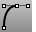
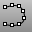

---
---

# Curve toolbar
{: #kanchor2316}
 [To open a toolbar](javascript:void(0);) Toolbars can be opened as a free-standing group or added to the current group.
To open a toolbar as a free-standing group
Click theOptionsicon in any toolbar group.On the menu, clickShow Toolbar, and then select the toolbar name from the list.To open a toolbar as a new tab in the current group
Click theOptionsicon in the toolbar group where you want to add the new tab.On the menu, clickShow or Hide Tabs, and then select the toolbar name from the list. [Conic](conic.html) 
Draw a conic section curve with options for the start, end, apex, and rho value.
 [Conic, *Perpendicular* ](conic.html#perpendicular) 
Draw a conic curve perpendicular at the start.
 [Conic, *Tangent at start* ](conic.html#tangent) 
Draw a conic curve tangent at the start.
 [Conic, *Tangent at start and end* ](conic.html#tangent) 
Draw a conic curve tangent at start and end.
 [Curve](curve.html) 
Draw a curve from [control point](controlpoint.html) locations.
 [CurveThroughPt](curvethroughpt.html) 
Fit a curve through point objects.
 [CurveThroughPolyline, *Control point* ](curvethroughpolyline.html) 
Creates a control-point curve though polyline vertices.
 [CurveThroughPolyline, *Interpolated* ](curvethroughpolyline.html) 
Creates an interpolated curve through polyline vertices.
 [HandleCurve](handlecurve.html) 
Draw chained [Bézier curves](http://en.wikipedia.org/wiki/Bézier_curve) with editing handles.
 [Helix](helix.html) 
Draw a helical curve with options for number of turns, pitch, vertical, reverse, and around a curve.
 [Helix, *Vertical* ](helix.html#vertical) 
Draw a vertical helical curve.
 [Hyperbola](hyperbola.html) 
Draw a hyperbolic curve from focus points, vertices, or coefficient.
 [InterpCrv](interpcrv.html) 
Fit a curve through picked locations.
 [HandleCurve](handlecurve.html) 
Draw chained [Bézier curves](http://en.wikipedia.org/wiki/Bézier_curve) with editing handles.
 [InterpCrvOnSrf](interpcrvonsrf.html) 
Fit a curve through locations on a surface.
 [Parabola, *Focus* ](parabola.html#focus) 
Draw a parabolic curve from focus points.
 [Parabola, *Vertex* ](parabola.html#vertex) 
Draw a parabolic curve from vertex and end.
 [Sketch](sketch.html) 
Drag the mouse to draw a curve.
 [Sketch, *on surface* ](sketch.html#onsurface) 
Drag the mouse to draw a curve on a selected surface.
 [Sketch, *on mesh* ](sketch.html#onmesh) 
Drag the mouse to draw a curve on a selected mesh object.
 [Spiral](spiral.html) 
Draw a spiral curve with options for number of turns, pitch, flat, vertical, and around a curve.
 [Spiral, *Flat* ](spiral.html#flat) 
Draw a flat spiral curve.
 [TweenCurves](tweencurves.html) 
Create curves between two open or closed input curves.
&#160;
&#160;
Rhinoceros 6 © 2010-2015 Robert McNeel &amp; Associates.11-Nov-2015
 [Open topic with navigation](curve-toolbar.html) 

