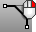
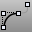
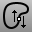
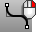
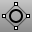
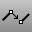
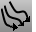
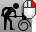
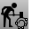

---
---

# Curve Tools toolbar
{: #kanchor2318}
 [To open a toolbar](javascript:void(0);) Toolbars can be opened as a free-standing group or added to the current group.
To open a toolbar as a free-standing group
Click theOptionsicon in any toolbar group.On the menu, clickShow Toolbar, and then select the toolbar name from the list.To open a toolbar as a new tab in the current group
Click theOptionsicon in the toolbar group where you want to add the new tab.On the menu, clickShow or Hide Tabs, and then select the toolbar name from the list. [ArcBlend](arcblend.html) 
Create an arc blend curve between two curves.
 [BlendCrv](blendcrv.html) 
Connect two curves with continuity control.
Blend
Connect two curves maintaining continuity.
 [Chamfer](chamfer.html) 
Create a line segment between two curves and trims or extends the curves to meet it.
 [Chamfer](chamfer.html), [Repeat](repeat.html) 
Repeats the Chamfer command until canceled.
 [ChangeDegree](changedegree.html) 
Change the degree of the polynomial that defines the curve or surface by adding or subtracting control points between knot spans, while maintaining the knot structure.
 [CloseCrv](closecrv.html) 
Close open curves.
 [ContinueCurve](continuecurve.html) 
Continue to draw the selected curve using control points.
 [ContinueInterpCrv](continuecurve.html#continueinterpcrv) 
Continue to draw the selected curve interpolating through picked points.
 [Convert,Curve to polyline](convert.html#lines) 
Change a curve to polyline segments.
 [Convert,Curve to arcs](convert.html#arcs) 
Change a curve to arc segments.
 [Crv2View](crv2view.html) 
Create a curve by averaging two input curves that are planar in two different views.
 [CrvSeam](crvseam.html) 
Change the seam (start/end) location on closed curves.
 [CSec](csec.html) 
Create cross-section curves through profile curves.
 [CurveBoolean](curveboolean.html) 
Trim, split, and join curves based on their overlapping regions.
 [DeleteSubCrv](deletesubcrv.html) 
Remove a portion of a curve that is between two locations.
 [Extend](extend.html) 
Lengthen a curve.
Link to [Extend toolbar](extend-toolbar.html) 
 [ExtractSubCrv](extractsubcrv.html) 
Separate or duplicate polycurve segments.
 [Fair](fair.html) 
Remove large curvature variations in a curve while limiting the geometry changes to the specified tolerance.
 [Fillet](fillet.html) 
Add an arc between two curves and trims or extends the curves to the arc.
 [Fillet](fillet.html), [Repeat](repeat.html) 
Repeats the Fillet command until canceled.
 [FilletCorners](filletcorners.html) 
Round polyline corners with arcs.
 [FitCrv](fitcrv.html) 
Make a non-rational NURBS curve of a specified degree that matches the input curve to within the specified tolerance.
 [InsertLineIntoCrv](insertlineintocrv.html) 
Flatten the curve segment between picked points.
 [MakePeriodic](makeperiodic.html) 
Remove the kink from the start/end of a curve or surface.
 [MakeNonPeriodic](makeperiodic.html#makenonperiodic) 
Insert a kink at the start/end of a curve or surface.
 [MakeUniform](makeuniform.html) 
Make the object knot vectors uniform without changing the control point locations.
 [Match](match.html) 
Change a curve end to meet another curve or surface edge with a specified continuity.
 [MatchCrvDir](matchcrvdir.html) 
Change a curve's direction to match another curve's direction.
 [Offset](offset.html) 
Copy a curve parallel to the original.
 [OffsetCrvOnSrf](offsetcrvonsrf.html) 
Copy a curve on a surface parallel to the original.
 [OffsetNormal](offsetnormal.html) 
Copy a curve on a surface parallel to the original in the surface normal direction.
 [PointsOn](pointson.html) 
Display curve and surface control points.
Link to [Point Edit toolbar](point-edit-toolbar.html) 
 [PointsOff](pointson.html#pointsoff) 
Turn off [control](pointson.html), [edit](pointson.html#editpton), and [solid](pointson.html#solidpton) points display.
 [Project](project.html) 
Project curves/points toward a construction plane to intersect a surface.
Link to [Curve From Object toolbar](curve-from-object-toolbar.html) 
 [Project,Loose](project.html#project-loose) 
Project curves/points toward a construction plane to intersect a surface using the Loose option.
 [Rebuild](rebuild.html) 
Reconstruct curves, surfaces, and extrusion objects to a specified degree and control point number.
 [Rebuild, *SelectMasterCurve* ](rebuild.html) 
Rebuild curves to match a master curve.
 [RebuildCrvNonUniform](rebuildcrvnonuniform.html) 
Interactively modify selected curves by non-uniformly re-spacing the control points.
 [SimplifyCrv](simplifycrv.html) 
Replace each curve segment that has the geometry of a line or an arc with a true line or arc.
 [SubCrv](subcrv.html) 
Shorten a curve to the new picked endpoints.
 [Symmetry](symmetry.html) 
Mirror a copy of a curve or surface with continuity.
 [TweenCurves](tweencurves.html) 
Create curves between two open or closed input curves.
&#160;
&#160;
Rhinoceros 6 © 2010-2015 Robert McNeel &amp; Associates.11-Nov-2015
 [Open topic with navigation](curve-tools-toolbar.html) 

