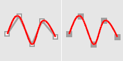
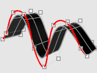

---
---

# CurveThroughPt
{: #kanchor528}
{: #kanchor527}
{: #kanchor526}
 [Where can I find this command?](javascript:void(0);) Toolbars
 [Curve](curve-toolbar.html)  [Curve Drawing](curve-drawing-toolbar.html)  [Main2](main2-toolbar.html) 
Menus
Curve
Free-Form
Fit To Points
 [&#160;History enabled](historyenabled.html) 
The CurveThroughPt command fits a curve through a selected point objects.
Steps
 [Select](select-objects.html) points.Command-line options
Degree
Specifies the [degree](degree.html) of the curve (or surface).
When drawing a high-degree curve, the output curve will not be the degree you request unless there is at least one more [control point](controlpoint.html) than the degree.
CurveType
ControlPoint
The curve's [control points](controlpoint.html) pass through the vertices, points, or control points.

Curve control points match input.

Resulting extruded surface.
Interpolated
The [curve](curve.html) passes through the vertices, points, or control points.

Curve matches input.

Resulting extruded surface.
Knots
Determines how an interpolated curve is parameterized. When the spacing between the picked points is equal for the whole curve, all three [parameterizations](parameterization.html) generate the same curve.
When you draw an interpolated curve, the points you pick are converted into knot values on the curve. The [parameterization](parameterization.html) means how the intervals between knots are chosen.
Uniform
The knot spacing is always 1 and is not based on the physical spacing of the points. Uniform [parameterization](parameterization.html) can be used if the point spacing is roughly equal and it is desirable to draw several curves that have the same parameterization. This is possible only with uniform curves (unless you rebuild the curves). Uniform guarantees that every [control point](controlpoint.html) affects the surface exactly the same way, no matter how much the surface is edited.
Chord
The spacing between the picked points is used for the knot spacing. This makes curves that have widely varying point spacing behave better than uniform curves.
SqrtChrd
The square root of the spacing between picked points is used for the knot spacing.
See also
 [Create curves from other objects](sak-curvefromobject.html) 
&#160;
&#160;
Rhinoceros 6 © 2010-2015 Robert McNeel &amp; Associates.11-Nov-2015
 [Open topic with navigation](curvethroughpt.html) 

