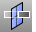

---
---

# CutPlane
{: #kanchor537}
{: #kanchor536}
{: #kanchor535}
 [Where can I find this command?](javascript:void(0);) Toolbars
 [Plane](plane-toolbar.html)  [Surface Sidebar](surface-sidebar-toolbar.html)  [Surface Creation](surface-creation-toolbar.html) 
Menus
Surface
Plane
Cutting Plane
The CutPlane command creates planar surfaces through objects at designated locations.
Steps
 [Select](select-objects.html) the objects that the cutting planes will pass through and press [Enter](enter-key.html). [Pick](pick-location.html) the start of a line that defines the cutting plane.Pick the end of a line that defines the cutting plane.The prompts repeat to make several cut planes. press [Enter](enter-key.html) to stop making cut planes.This command creates planes perpendicular to the current construction planes. These planes pass through the selected objects and are large enough to intersect all of the objects.Your browser does not support the video tag.Command-line option
{: #3point}3Point
Draws the rectangle using two adjacent corner locations and a location on the opposite side.
3Point steps
 [Pick](pick-location.html) the start of an edge.Pick the end of the edge.Pick or type the width.See also
 [Create surfaces](sak-surface.html) 
&#160;
&#160;
Rhinoceros 6 © 2010-2015 Robert McNeel &amp; Associates.11-Nov-2015
 [Open topic with navigation](cutplane.html) 

