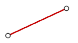
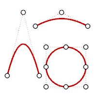
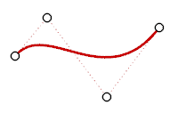

---
---

Degree
A polynomial is a function like (y= 3x3-2x+1). The degree of the polynomial is the largest power of the variable. For example, the degree of (3x3-2x+2) is 3; the degree of (-x5+x2) is 5, and so on. [NURBS](http://www.rhino3d.com/nurbs) functions are rational polynomials and the degree of the NURBS is the degree of the polynomial. From a NURBS modeling point of view, the (degree –1) is the maximum number of "bends" you can get in each span.
For example:
A line has degree 1. It has zero bends.

Degree 1: line.
A parabola, hyperbola, arc, and circle (conic section curves) have degree 2. They have one bend.

Degree 2: parabola, arc, circle.
A cubic Bézier has degree 3. If you arrange its control points in a zigzag shape, you can get two bends.
Degree 3 curve.
 [Open topic with navigation](degree.html) 

