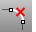

---
---

# DeleteSubCrv
{: #kanchor555}
{: #kanchor554}
{: #kanchor553}
{: #kanchor552}
{: #kanchor551}
 [Where can I find this command?](javascript:void(0);) Toolbars
 [Curve Tools](curve-tools-toolbar.html) 
Menus
Curve
Curve Edit Tools
Delete Subcurve
Alias
 [Break](aliases.html) 
The DeleteSubCrv command removes a portion of a curve that is between two selected locations.
Steps
 [Select](select-objects.html) a curve. [Pick](pick-location.html) a start for the deletion.Pick an end for the deletion or enter a length.Your browser does not support the video tag.See also
 [Edit curves](sak-curvetools.html) 
&#160;
&#160;
Rhinoceros 6 © 2010-2015 Robert McNeel &amp; Associates.11-Nov-2015
 [Open topic with navigation](deletesubcrv.html) 

