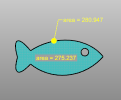

---
---

# DimArea
{: #kanchor596}
 [Where can I find this command?](javascript:void(0);) Toolbars
 [Not on toolbars.](toolbarwhattodo.html) 

Menus
Dimension
Area Dimension
 [&#160;History enabled](historyenabled.html) 
The DimArea command dimensions the area of a closed curve, surface, mesh, or hatch.

Steps
 [Select](select-objects.html) a closed curve, surface, mesh, or hatch. [Pick](pick-location.html) a start point for the text or leader.If theLeaderoption is used, continue to draw leader points as for the [Leader](leader.html) command.The area of the object is automatically entered.Command-line options
Style
Leader
Uses a [leader](leader.html) to point to the object.
Text
Places the text at the picked location.
The dimension uses a [text field](text-fields.html) for calculating the dimension.
See also
 [Use text and dimensions for annotation](sak-textanddimensions.html) 
&#160;
&#160;
Rhinoceros 6 © 2010-2015 Robert McNeel &amp; Associates.11-Nov-2015
 [Open topic with navigation](dimarea.html) 

