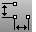
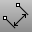
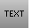

---
---

# Dimension toolbar
{: #kanchor2320}
 [To open a toolbar](javascript:void(0);) Toolbars can be opened as a free-standing group or added to the current group.
To open a toolbar as a free-standing group
Click theOptionsicon in any toolbar group.On the menu, clickShow Toolbar, and then select the toolbar name from the list.To open a toolbar as a new tab in the current group
Click theOptionsicon in the toolbar group where you want to add the new tab.On the menu, clickShow or Hide Tabs, and then select the toolbar name from the list. [Dim](dim.html) 
Draw horizontal or vertical linear dimensions.
 [Dimension styles](dimensions.html) 
Manage font, number format, sizes, arrow style, alignment settings for the current model.
 [Dimension, *Horizontal* ](dim.html#horizontal) 
Draws horizontal linear dimensions.
 [Dimension, *Vertical* ](dim.html#vertical) 
Draws vertical linear dimensions.
 [DimAligned](dimaligned.html) 
Draw a linear dimension lined up with two points.
 [DimAngle](dimangle.html) 
Dimension the angle between two lines.
 [DimCreaseAngle](dimcreaseangle.html) 
Dimension the angle between two planes.
 [DimDiameter](dimdiameter.html) 
Dimension the diameter of a curve.
 [DimOrdinate](dimordinate.html) 
Dimension the x or y&#160;distance from a base location.
 [DimRadius](dimradius.html) 
Dimension the radius of an arc or circle.
 [DimRecenterText](dimrecentertext.html) 
Return dimension text to its default location.
 [DimRotated](dimrotated.html) 
Draw a linear dimension that is rotated from the xy axis.
 [Dot](dot.html) 
Draw an annotation dot that stays parallel to and sizes with the view.
Link to: [Annotate toolbar](annotate-toolbar.html) 
 [EditText](edittext.html) 
Open an edit box in the viewport for changing text or annotation dot.
 [Hatch](hatch.html) 
Create a pattern of lines to fill bounding curves.
 [ImportDimStyles](dimensions-style.html#importdimstyles) 
Import dimension styles into the current document.
 [Leader](leader.html) 
Draw an annotation leader with attached text.
 [Make2D](make2d.html) 
Project geometry to the construction plane.
 [RevCloud](revcloud.html) 
Draw revision cloud curves.
 [ScaleDimstyle](dimensions-style.html#scaledimstyle) 
Scales all of the distances in a dimension scale at once.
 [SetCurrentDimstyle](dimensions-style.html#setcurrentdimstyle) 
Specify the current [dimensions style](dimensions-style.html).
 [SetLinetype](linetypes.html#setlinetype) 
Specify a curve's linetype.
 [Text](text.html) 
Create annotation text.
 [Text,Single line](text.html) 
Creates asingle line ofannotation text.
&#160;
&#160;
Rhinoceros 6 © 2010-2015 Robert McNeel &amp; Associates.11-Nov-2015
 [Open topic with navigation](dimension-toolbar.html) 

