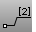
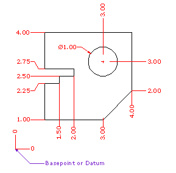

---
---

# DimOrdinate
{: #kanchor603}
{: #kanchor602}
 [Where can I find this command?](javascript:void(0);) Toolbars
 [Dimension](dimension-toolbar.html)  [Drafting](drafting-toolbar.html) 
Menus
Dimension
Ordinate Dimension
 [&#160;History enabled](historyenabled.html) 
The DimOrdinate command dimensions the x or y&#160;distance from a base location.

Note
Ordinate dimensions show the horizontal or vertical distance from an origin point (called the basepoint) to a dimensioned feature, such as a hole Center or a feature in a part.Ordinate dimensions are widely used in CNC related manufacturing industries because the clutter caused by dimensions is minimized.This type of dimension prevents accumulated errors by showing the X or Y offset of the feature from the basepoint.The shape of the ordinate leader can be point edited after creation to avoid overlapping geometry.
Steps
 [Pick](pick-location.html) a dimension point.An XDatum dimension is implied if your second pick is primarily above or below the first pick.A YDatum dimension is implied if your second pick is primarily left or right from the first pick.Pick a leader endpoint.Press [Enter](enter-key.html) when finished placing dimensions.Command-line options
Style
Enter the [dimension style](dimensions.html) name.
XDatum
Overrides the implied biasing and forces an X&#160;ordinate dimension.
YDatum
Overrides the implied biasing and forces a Y&#160;ordinate dimension.
Basepoint
Changes the basepoint for the duration of the command. The basepoint reverts to the default construction plane origin when theDimOrdinatecommand is run again.
See also
 [Dimension Properties](dimension.html) 
Manage angle brackets, dimension display, degree, diameter, plus/minus symbols.
 [Use text and dimensions for annotation](sak-textanddimensions.html) 
&#160;
&#160;
Rhinoceros 6 © 2010-2015 Robert McNeel &amp; Associates.11-Nov-2015
 [Open topic with navigation](dimordinate.html) 

