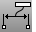
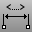

---
---

# DimRecenterText
{: #kanchor608}
{: #kanchor607}
 [Where can I find this command?](javascript:void(0);) Toolbars
 [Dimension](dimension-toolbar.html)  [Drafting](drafting-toolbar.html) 
Menus
Dimension
Recenter Dimension Text
The DimRecenterText command returns dimension text to its default location.
Steps
 [Select](select-objects.html) dimensions.To move dimension text away from the dimension line, turn on the dimension [control points](pointson.html) and drag the text control point.Your browser does not support the video tag.See also
 [Dimension Properties](dimension.html) 
Manage angle brackets, dimension display, degree, diameter, plus/minus symbols.
 [Use text and dimensions for annotation](sak-textanddimensions.html) 
&#160;
&#160;
Rhinoceros 6 © 2010-2015 Robert McNeel &amp; Associates.11-Nov-2015
 [Open topic with navigation](dimrecentertext.html) 

