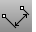

---
---

# DimRotated
{: #kanchor610}
{: #kanchor609}
 [Where can I find this command?](javascript:void(0);) Toolbars
 [Dimension](dimension-toolbar.html)  [Drafting](drafting-toolbar.html) 
Menus
Dimension
Rotated Dimension
 [&#160;History enabled](historyenabled.html) 
The DimRotated command draws a linear dimension that is rotated from the xy axis.
Steps
 [Pick](pick-location.html) two points to establish a rotation angle.Pick the first dimension point.Pick the second dimension point.Pick the dimension location.Your browser does not support the video tag.Command-line options
Style
Enter the [dimension style](dimensions.html) name.
Object
Select an object to dimension.
Continue
Add more (chain) dimensions along the same dimension line.
See also
 [Dimension Properties](dimension.html) 
Manage angle brackets, dimension display, degree, diameter, plus/minus symbols.
 [Use text and dimensions for annotation](sak-textanddimensions.html) 
&#160;
&#160;
Rhinoceros 6 © 2010-2015 Robert McNeel &amp; Associates.11-Nov-2015
 [Open topic with navigation](dimrotated.html) 

