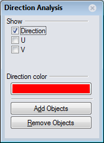
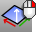

---
---

# Dir
{: #kanchor615}
{: #kanchor614}
{: #kanchor613}
{: #kanchor612}
{: #kanchor611}
 [Where can I find this command?](javascript:void(0);) Toolbars
 [Analyze](analyze-toolbar.html)  [Surface Tools](surface-tools-toolbar.html)  [Main2](main2-toolbar.html) 
Menus
Analyze
Direction
The Dir command displays and edits an object's normal direction.
Closed polysurfaces, surfaces, and [lightweight extrusion objects](sak-extrude.html) cannot have their [normal direction](curvesurfacedirection.html) facing toward the interior of the object.
Your browser does not support the video tag.Steps
 [Select](select-objects.html) objects.Arrows show the [ [normal direction](curvesurfacedirection.html) ](#) .Move the cursor over the object to show a dynamic arrow for the direction.Click the mouse to flip (reverse) the normal direction.Your browser does not support the video tag.Single Curve Options
Flip
Reverses the [direction](curvesurfacedirection.html).
Multiple Curve Options
Click an individual curve to change its direction.
FlipAll
Reverses the direction on all selected curves.
Single Surface Options
The arrow color for the u and v [directions](curvesurfacedirection.html) matches the construction plane x and y&#160;axis colors.
The [draft angle](draftangleanalysis.html) for surfaces displays on the status bar.
UReverse/VReverse
Reverses the surface u or v&#160;direction.
SwapUV
Switches the u and v&#160;directions.
{: #flip}Flip
Reverses the [direction](curvesurfacedirection.html).
Multiple Surface Options
Click on any individual surface to flip the normal.
FlipAll
Reverses the direction on all selected surfaces.
NextMode
Cycles through theModesfor all of the selected surfaces.
Mode
FlipU/FlipV
Reverses the u&#160;direction or v&#160;direction for all of the selected surfaces.
FlipNormal
Reverses the normal direction for all of the selected surfaces.
SwapUV
Switches the u and v&#160;directions for all of the selected surfaces.
Notes
The colors of the surface direction arrows match the [X/Y/Z axis lines](appearance-colors.html#xyz-axis-line) set in [Appearance: Colors Options](appearance-colors.html) .The normal direction arrow color is controlled by the [Tracking lines](appearance-colors.html#tracking-lines) setting in [Appearance: Colors Options](appearance-colors.html) .The size of the arrows is controlled by the [Direction arrow icon](appearance.html#directionarrow) setting in [Appearance Options](appearance.html).
## 
{: #normaldirection}

# Related commands
{: #kanchor616}{: #kanchor617}{: #kanchor618}{: #kanchor619}

## ShowDir
{: #showdir}
 [Where can I find this command?](javascript:void(0);) Toolbars
 [Analyze](analyze-toolbar.html) 
Menus
 [Not on menus.](menuwhattodo.html) 
The ShowDir command opens the Direction Analysis control and displays the [direction](curvesurfacedirection.html) of curves, surfaces, and polysurfaces.
Steps
 [Select](select-objects.html) objects.Direction arrows display on the object.Direction Analysis options
Show
Direction
Displays the object's [normal](curvesurfacedirection.html) direction.
U(Surfaces only)
Displays the [u&#160;direction](curvesurfacedirection.html#uvdirections).
V(Surfaces only)
Displays the [v&#160;direction](curvesurfacedirection.html#uvdirections).

Direction color
Set the display color for the direction arrows.

The u and v&#160;direction colors are determined by the [Options&#160;&gt; Appearance&#160;&gt; Colors](appearance-colors.html) settings for the [X&#160;axis](appearance-colors.html#xyz-axis-line) and [Y&#160;axis](appearance-colors.html#xyz-axis-line) lines.
 **Add Objects** 
Add objects to the Direction Analysis display.
 **Remove Objects** 
Remove objects from the Direction Analysis display.

## ShowDirOff
{: #showdiroff}
 [Where can I find this command?](javascript:void(0);) Toolbars
 [Analyze](analyze-toolbar.html) 
Menus
 [Not on menus.](menuwhattodo.html) 
The ShowDirOff command closes the Direction Analysis control and turns off [direction](curvesurfacedirection.html) display.
See also
 [Dir](#) 
Display and edit an object's normal direction.
 [ShowDir](#showdir) 
Open the Direction Analysis control and turn on direction analysis for curves, surfaces, and polysurfaces.
 [Analyze objects](sak-analysis.html) 
 [Manage object visibility](sak-visibility.html) 
&#160;
&#160;
Rhinoceros 6 © 2010-2015 Robert McNeel &amp; Associates.11-Nov-2015
 [Open topic with navigation](dir.html) 

