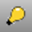

---
---

# DirectionalLight
{: #kanchor621}
{: #kanchor620}
 [Where can I find this command?](javascript:void(0);) Toolbars
 [Lights](lights-toolbar.html)  [Rende](render-tools-toolbar.html)  [r Tools](render-tools-toolbar.html) 
Menus
Render
Create Directional Light
The DirectionalLight command inserts a light that simulates the sun defined with parallel rays and a direction.
Location point (1), dolly point (2), target point (3).
Steps
 [Pick](pick-location.html) a location at which to aim the directional light.Pick a location for the directional light.Note
A directional light shines toward a specified direction. The location of the light does not matter: the light object merely indicates the direction the light shines.Turn on the light's control points and move or drag the control points to edit the light's direction and target.To move the light without changing its direction, move the *dolly point* (the control point at the midpoint on the direction vector).See also
 [LinearLight](linearlight.html) 
Insert a tubular light.
 [PointLight](pointlight.html) 
Insert an omni-directional light.
 [RectangularLight](rectangularlight.html) 
Insert a rectangular directional light.
 [Spotlight](spotlight.html) 
Insert a light cone object.
 [Lights](lights.html) 
Open the Lights panel.
 [Render](render.html) 
Render the objects using the current renderer.
 [Add lights](sak-lights.html) 
&#160;
&#160;
Rhinoceros 6 © 2010-2015 Robert McNeel &amp; Associates.11-Nov-2015
 [Open topic with navigation](directionallight.html) 

