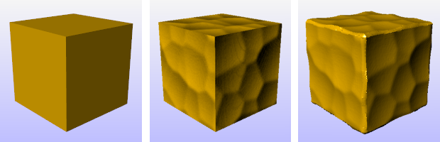

---
---

{: #kanchor2789}
# Displacement
 [Where can I find this command?](javascript:void(0);) Toolbars
 [Popup](popup-toolbar.html)  [Properties](properties-toolbar.html)  [Standard](standard-toolbar.html) 
Menus
Edit and Panels
Object Properties
Shortcut
F3
Displacement constructs a displacement display mesh for surfaces, polysurfaces, or meshes.

Gold color material (left), gold color material with bump map (center), gold color materialwith displacement map (right).
Note
The displacement map can be a procedural or an image texture.Displacement appears as an object property for the surface.The displacement map differs from a bump map set by the rendering material in that the displacement mesh is a real object with edges that produce real highlights and shadows. The illustrations use the same image for the bump and the displacement.Steps
 [Select objects](selection-commands.html#select-object-basics) to apply displacement mapping to.In the **Properties** panel, click theDisplacementbutton.Specify the displacement properties.Displacement properties
Manages surface displacement [properties](properties.html) for the selected objects.
Basic settings
On
Enables the displacement mapping display.
Texture
Specifies a procedural texture or image file used to map the displacement.
Import from file
Opens a Rhino Texture file (.rtex) or supported image formats.
Note
Rhino supports the following file formats:
Transparency isnotsupported in these formats:
JPEG - JFIF Compliant (*.jpg, *.jpeg, *.jpe){: #kanchor2790}{: #kanchor2791}Windows Bitmap (*.bmp)Transparencyissupported in these formats:
{: #kanchor2792}{: #kanchor2793}DDS files (*.dds){: #kanchor2794}{: #kanchor2795}HDRi files (*.hdr, *. hdri){: #kanchor2796}{: #kanchor2797}OpenEXR files (*.exr){: #kanchor2798}{: #kanchor2799}Portable Network Graphics (*.png){: #kanchor2800}{: #kanchor2801}Tagged Image File Format (*.tif, *.tiff){: #kanchor2802}{: #kanchor2803}Truevision Targa (*.tga)New
Creates a new displacement texture.
Edit
Edits the current displacement texture settings.
Duplicate
Duplicates the current displacement texture settings.
Mapping channel
Mapping channel number for the displacement mapping.
Displacement
Black point
Amount of displacement (in currently used units) for black colors on displacement texture. Can be any number.
White point
The amount of displacement for the white color in the procedure or image.
Mesh detail settings
Initial quality
Specifies how densely the object is subdivided and displacement texture is sampled initially. Using too low initial quality may result in loss of some features in the displacement. Too high initial quality makes displacement process unnecessarily dense and slow.
Low
Medium
High
Very High
Extremely High
Max faces
Runs a mesh reduction as a post process and simplifies the result of displacement to meet the specified number of faces.
Fairing
Straightens rough feature edges. This is similar to anti-aliasing. The value specifies the number of passes.
Advanced settings
Post weld angle
Specifies the maximum angle between face normals of adjacent faces that will get [welded](weld.html) together.
Mesh memory limit (MB)
Specifies in megabytes how much memory can be allocated for use by the displacement mesh.
Refine steps
After the initial subdivision and displacement texture sampling further refinement takes place. The value specifies the number of refinement passes.
Refine sensitivity
Specifies how sensitive the divider for contrasts on the displacement texture is. Specify 1 to split all mesh edges on each refine step. Specify 0.99 to make even slight contrasts on the displacement texture cause edges to be split. Specifying 0.01 only splits edges where heavy contrast exists.
See also
 [Use materials and textures](sak-materialsandtextures.html) 
&#160;
&#160;
Rhinoceros 6 © 2010-2015 Robert McNeel &amp; Associates.11-Nov-2015
 [Open topic with navigation](displacement.html) 

