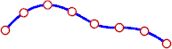

---
---

# Divide
{: #kanchor776}
{: #kanchor775}
{: #kanchor774}
 [Where can I find this command?](javascript:void(0);) Toolbars
 [Point](point-toolbar.html) 
Menus
Curve
Point Object
Divide Curve by
Number of Segments
Length of Segments
 [&#160;History enabled](historyenabled.html) 
The Divide command creates point objects or along a curve or splits a curve by the number of equal length segments or segments of a specified length.

Steps
 [Select](select-objects.html) curves.Type the number of segments.The point objects this command creates are spaced evenly along the curve, with an additional point at each end of the curve.Command-line options
Length
Creates point objects on a curve starting from the natural start of the curve.
To start measuring at the other end, click the curve to flip the direction.
Split
Splits the curve instead of placing point objects.
MarkEnds
Places a point at the ends of the curve.
GroupOutput
 [Groups](group.html) the resulting objects.
See also
 [Point](point.html) 
Draw a single point object.
&#160;
&#160;
Rhinoceros 6 © 2010-2015 Robert McNeel &amp; Associates.11-Nov-2015
 [Open topic with navigation](divide.html) 

