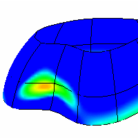
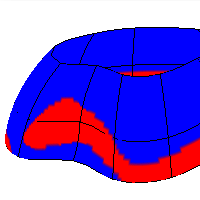

---
---

# DraftAngleAnalysis
{: #kanchor785}
{: #kanchor784}
{: #kanchor783}
 [Where can I find this command?](javascript:void(0);) Toolbars
 [Surface Analysis](surface-analysis-toolbar.html) 
Menus
Analyze
Surface
Draft Angle Analysis
The DraftAngleAnalysis command visually evaluates surface draft-angle using false-color analysis.
Draft angle is used to design injection-molded parts that must eject from molds.

Steps
 [Select](select-objects.html) objects.In theDraft Angledialog box, set the angle for the color display.The draft angle depends on the construction plane orientation.When the surface is vertical/perpendicular to the construction plane, the draft angle is zero.When the surface is parallel to the construction plane, the draft angle is 90 degrees.Adjust the density of the mesh if the level of detail is not fine enough.Note
If you set the minimum and maximum angle to the same value, all portions of the surface that exceed the angle will be red.The pull direction forDraftAngleAnalysisis the z&#160;axis of the construction plane that is in the active viewport when the command starts.The normal direction of the surface is the same as the pull direction of the mold. You can check this with the [Dir](dir.html) command.Changing the construction plane before usingDraftAngleAnalysislets you define any direction as the pull direction.
# DraftAngleAnalysisOff
{: #kanchor786}
{: #draftangleanalysisoff}
 [Where can I find this command?](javascript:void(0);) Toolbars
 [Surface Analysis](surface-analysis-toolbar.html) 
Menus
 [Not on menus.](menuwhattodo.html) 
Close the dialog box.
The DraftAngleAnalysisOff command turns off draft angle analysis.
See also
 [Analyze objects](sak-analysis.html) 
&#160;
&#160;
Rhinoceros 6 © 2010-2015 Robert McNeel &amp; Associates.11-Nov-2015
 [Open topic with navigation](draftangleanalysis.html) 

