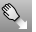
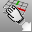
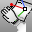
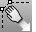

---
---

# Drag Mode toolbar
{: #kanchor2323}
 [To open a toolbar](javascript:void(0);) Toolbars can be opened as a free-standing group or added to the current group.
To open a toolbar as a free-standing group
Click theOptionsicon in any toolbar group.On the menu, clickShow Toolbar, and then select the toolbar name from the list.To open a toolbar as a new tab in the current group
Click theOptionsicon in the toolbar group where you want to add the new tab.On the menu, clickShow or Hide Tabs, and then select the toolbar name from the list. [DragMode](dragmode.html) 
Specify the plane object dragging will be parallel to.
 [DragMode, *CPlane* ](dragmode.html#cplane) 
Set drag mode to construction plane.
 [DragMode, *World* ](dragmode.html#world) 
Set drag mode to world.
 [DragMode, *UVN* ](dragmode.html#uvn) 
Set drag mode to surface UVN.
 [DragMode, *ControlPolygon* ](dragmode.html#controlpolygon) 
Set drag mode to control polygon.
 [DragMode, *View* ](dragmode.html#view) 
Set drag mode to view.
&#160;
&#160;
Rhinoceros 6 © 2010-2015 Robert McNeel &amp; Associates.11-Nov-2015
 [Open topic with navigation](drag-mode-toolbar.html) 

