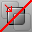

---
---

# Draw Order toolbar
{: #kanchor2324}
 [To open a toolbar](javascript:void(0);) Toolbars can be opened as a free-standing group or added to the current group.
To open a toolbar as a free-standing group
Click theOptionsicon in any toolbar group.On the menu, clickShow Toolbar, and then select the toolbar name from the list.To open a toolbar as a new tab in the current group
Click theOptionsicon in the toolbar group where you want to add the new tab.On the menu, clickShow or Hide Tabs, and then select the toolbar name from the list. [BringForward](draworder.html#bringforward) 
Bring curves forward in draw order.
 [BringToFront](draworder.html#bringtofront) 
Bring curves to the front in draw order.
 [ClearDrawOrder](draworder.html#cleardraworder) 
Return curve draw order to the default.
 [SendBackward](draworder.html#sendbackward) 
Send curves backward in draw order
 [SendToBack](draworder.html#sendtoback) 
Send curves to back of draw order
&#160;
&#160;
Rhinoceros 6 © 2010-2015 Robert McNeel &amp; Associates.11-Nov-2015
 [Open topic with navigation](draw-order-toolbar.html) 

