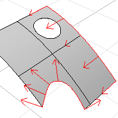

---
---

# DupEdge
{: #kanchor806}
{: #kanchor805}
{: #kanchor804}
{: #kanchor803}
 [Where can I find this command?](javascript:void(0);) Toolbars
 [Curve From Object](curve-from-object-toolbar.html) 
Menus
Curve
Curve From Objects
Duplicate Edge
The DupEdge command creates a curve that duplicates a surface edge.

Steps
 [Select](select-objects.html) the edges of a surface.The curve has a different [control points](controlpoint.html) structure than the original curve used to trim the surface.Command-line options
OutputLayer
Specifies the layer for the results of the command.
Current
Places the results on the current layer.
Input
Places the results on the same layer as the input curve.
TargetObject
Places the results on the same layer as the target surface.
See also
 [Create curves from other objects](sak-curvefromobject.html) 
&#160;
&#160;
Rhinoceros 6 © 2010-2015 Robert McNeel &amp; Associates.11-Nov-2015
 [Open topic with navigation](dupedge.html) 

