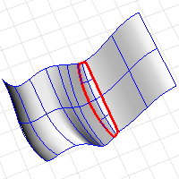

---
---

# DupFaceBorder
{: #kanchor809}
{: #kanchor808}
{: #kanchor807}
 [Where can I find this command?](javascript:void(0);) Toolbars
 [Curve From Object](curve-from-object-toolbar.html) 
Menus
Curve
Curve From Objects
Duplicate Face Border
The DupFaceBorder command creates a curve that duplicates a polysurface face border.

Steps
 [Select](select-objects.html) a surface or polysurface face, and press [Enter](enter-key.html) .Command-line options
OutputLayer
Specifies the layer for the results of the command.
Current
Places the results on the current layer.
Input
Places the results on the same layer as the input curve.
TargetObject
Places the results on the same layer as the target surface.
See also
 [Create curves from other objects](sak-curvefromobject.html) 
&#160;
&#160;
Rhinoceros 6 © 2010-2015 Robert McNeel &amp; Associates.11-Nov-2015
 [Open topic with navigation](dupfaceborder.html) 

