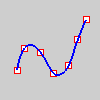

---
---

Edit points
Edit points on a curve are displayed at [knot](knot.html) averages.

For example, if the curve degree is three and the knot vector is
0, 0, 0, 1, 2, 3, 3, 3
the edit points are points on the curve evaluated at these parameter values:
0, 1/3, 1, 2, 8/3, 3
Edit points are like [control points](controlpoint.html) except they are always located on the curve and moving one edit point generally changes the shape of the entire curve (moving one control point only changes the shape of the curve in a sub region). Edit points are most useful when you need a point on the interior of a curve to pass exactly through a certain location. Control point editing is preferred when you need to change the look of a curve and maintaining "fairness" is important.
Notes
While edit points in Rhino are points on the curve evaluated at knot averages, they are not knots themselves.When edit points are on, they can be selected and deleted. Moving edit points changes the shape of the curve.To display curve and surface control points
Use the [EditPtOn](pointson.html#pointson) command.See also
 [EditPtOn](pointson.html#editpton) 
Display points on the curve evaluated at [knot](knot.html) averages.
 [PointsOn](pointson.html) 
Display curve and surface control points.
 [PointsOff](pointson.html#pointsoff) 
Turn off [control](pointson.html), [edit](pointson.html#editpton), and [solid](pointson.html#solidpton) points display.
 [Open topic with navigation](editpoint.html) 

