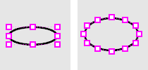

---
---

# Ellipse
{: #kanchor907}
{: #kanchor906}
{: #kanchor905}
 [Where can I find this command?](javascript:void(0);) Toolbars
 [Curve Drawing](curve-drawing-toolbar.html)  [Ellipse](ellipse-toolbar.html)  [Main Sidebar](main-sidebar-toolbar.html)  [Main2](main2-toolbar.html) 
Menus
Curve
Ellipse
From Center
Diameter
From Foci
The Ellipse command draws a closed elliptical curve.
Steps
 [Pick](pick-location.html) the center.Pick the end of the first axis.Pick the end of second axis.Your browser does not support the video tag.Command-line options
Default
Creates the ellipse from the center, first axis, and second axis.
Default steps
 [Pick](pick-location.html) the center.Pick the end of the first axis.Pick the end of second axis.Your browser does not support the video tag.{: #deformable}Deformable
A [NURBS](http://www.rhino3d.com/nurbs) approximation of the curve will be created with the degree and number of points you specify.

Not deformable degree 2 (left); Deformable degree 3 (right).
PointCount
Sets the number of [control points](controlpoint.html) in the curve.
Vertical
Draws the ellipse center point and axes perpendicular to the construction plane.
Vertical steps
 [Pick](pick-location.html) the center.Pick end of the first axis.Pick the end of the second axis.Your browser does not support the video tag.{: #corner}Corner
Draws the ellipse from the corners of an enclosing rectangle.
Corner steps
 [Pick](pick-location.html) a corner for the enclosing rectangle.Pick the opposite corner of the enclosing rectangle.Your browser does not support the video tag.{: #diameter}Diameter
Draws the ellipse from points on its axes.
Diameter steps
 [Pick](pick-location.html) the start of the first axis.Pick the end of the first axis.Pick the end of the second axis.Your browser does not support the video tag.{: #fromfoci}FromFoci
Draws the ellipse from focus points and a point on the curve.
FromFoci steps
 [Pick](pick-location.html) the first focus.Pick the second focus.Pick a point on the ellipse curve.Your browser does not support the video tag.FromFoci command-line option
MarkFoci
Places a [point object](point.html) at the focus locations.

{: #aroundcurve}AroundCurve
Draws the ellipse around a curve.
Steps
 [Pick](pick-location.html) the center on a curve.Pick the end of the first axis.Pick the end of the second axis.Your browser does not support the video tag.See also
 [Draw lines and curves](sak-curve.html) 
&#160;
&#160;
Rhinoceros 6 © 2010-2015 Robert McNeel &amp; Associates.11-Nov-2015
 [Open topic with navigation](ellipse.html) 

