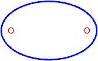

---
---

# Ellipsoid
{: #kanchor909}
{: #kanchor908}
 [Where can I find this command?](javascript:void(0);) Toolbars
 [Ellipsoid](ellipsoid-toolbar.html)  [Solids Creation](solid-creation-toolbar.html)  [Solids Sidebar](solids-sidebar-toolbar.html) 
Menus
Solid
Ellipsoid
From Center
From Foci
TheEllipsoidcommand draws a solid ellipsoid.
Steps
 [Pick](pick-location.html) the center.Pick the end of the first axis.Pick the end of second axis.See the [Ellipse](ellipse.html) command for option descriptions.Pick the end of the third axis.Your browser does not support the video tag.Command-line options
{: #corner}Corner
Draws the base ellipse from the corners of an enclosing rectangle.
{: #diameter}Diameter
Draws the base ellipse from points on its axes.
Diameter command-line option
Vertical
Draws the base ellipse center point and axes perpendicular to the construction plane.
{: #fromfoci}FromFoci
Draws the ellipse from focus points and a point on the curve.
FromFoci command-line option
MarkFoci
Places a [point object](point.html) at the focus locations.

{: #aroundcurve}AroundCurve
Draws the ellipse around a curve.
See also
 [Create solid objects](sak-solid.html) 
&#160;
&#160;
Rhinoceros 6 © 2010-2015 Robert McNeel &amp; Associates.11-Nov-2015
 [Open topic with navigation](ellipsoid.html) 

