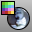

---
---

# EMap
{: #kanchor913}
{: #kanchor912}
{: #kanchor911}
{: #kanchor910}
 [Where can I find this command?](javascript:void(0);) Toolbars
 [Surface Analysis](surface-analysis-toolbar.html) 
Menus
Analyze
Surface
Environment Map
The EMap command visually evaluates surface smoothness using an image reflected in the surface.

Steps
In theEnvironment Map Optionsdialog box, select an image file to use for mapping.EMap Options
 **Current image** 
Displays environment images used in the model.
 **Browse** 
Browse for an image to use.
Blend with object render color
This blends the image with the render color of the object, which lets you simulate different materials with the environment map. To simulate different materials, use a neutral colored bitmap and blend with the object render color.

Show isocurve
Displays isocurves on the objects.
 **Adjust Mesh** 
Opens the [Polygon Mesh Detailed Options](polygon-mesh-detailed-options.html) dialog box.
 **Add Objects** 
Turn on environment mapping analysis for additional selected objects.
 **Remove Objects** 
Turn off environment mapping analysis for selected objects.
Note
TheEMapcommand is one of a series of visual surface analysis commands. These commands use [NURBS](http://www.rhino3d.com/nurbs) surface evaluation and rendering techniques to help you visually analyze surface smoothness, curvature, and other important properties.If, when you use theEMapcommand, any selected object does not have a surface analysis mesh, an invisible mesh will be created based on the settings in thePolygon Mesh Optionsdialog box.The surface analysis meshes are saved in the Rhino files. These meshes can be large. Both the [RefreshShade](refreshshade.html) command and theSave geometry onlyoption of the [Save](save.html) and [SaveAs](save.html#saveas) commands remove any existing surface analysis meshes.To properly analyze a free-form [NURBS](http://www.rhino3d.com/nurbs) surface, the analysis commands generally require a detailed mesh.Environment mapping is a rendering style that makes it look as though a scene is being reflected by a highly polished metal. There may be a few cases in which environment mapping actually shows a surface defect that can't be seen when you use [Zebra](zebra.html) and rotate the scene.
## Environment map images
Images for environment mapping are created by photographing a reflective sphere in various environments.

Manipulating a flat image to be round using a paint program does not work, for this procedure doesn't capture the whole environment. To better understand why, find something (anything) that's reflective and look at the reflections carefully. A chrome toaster, or some other approximately spherical object, will aid your understanding especially well.
As you look into the center of the object you will see yourself. But as you look toward the edge of the object (where the surface normal is almost perpendicular to the direction you are looking) you will see that the reflected object is almost exactly behind the object you are looking at. The result is that a reflective sphere shows a distorted view of the entire scene around it - in front of, beside, and behind the sphere. All reflective objects do the same.
A photograph, on the other hand, shows only a small portion of what is in front of the camera, which is not even close to a 360 degree view. You can use a fish-eye lens to get a closer approximation, but you still only get a 180 degree view at best.
There are some software programs that will take a series of panoramic photos (take them by putting your camera on a tripod and rotating the camera until you get shots of everything around the camera) and combine them into a spherical map.

# EMapOff
{: #kanchor914}
{: #emapoff}
 [Where can I find this command?](javascript:void(0);) Toolbars
 [Surface Analysis](surface-analysis-toolbar.html) 
Menus
 [Not on menus.](menuwhattodo.html) 
Close the dialog box
The EMapOff command turns off environment map display.
See also
 [Analyze objects](sak-analysis.html) 
&#160;
&#160;
Rhinoceros 6 © 2010-2015 Robert McNeel &amp; Associates.11-Nov-2015
 [Open topic with navigation](emap.html) 

