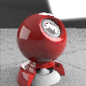

---
---

## Environment tools menu
Set as Custom Skylighting Environment
Sets the environment as a skylight environment.
Set as Custom Reflective Environment
Sets the environment as a reflective environment.
Create New Environment
Creates a new basic neutral gray background.
Import Environment from File
Imports an environment from a saved Rhino .renv file.
Save to File
Saves an environment to a Rhino .renv file.
Reset to Defaults
Changes all of the environment settings to the default neutral gray background.
Copy{: #copy}
Copies the selected environment to the Clipboard. The Clipboard can then be pasted into the editor to create a new environment or pasted directly into a folder to create a [library](libraries.html#libraries) file.
Paste
Creates a new environment based on the contents of the Clipboard.
Paste as Instance
Creates a new environment based on the contents of the Clipboard that is linked to the original through instancing.
Delete
Deletes the selected environment.
Tags
Tag textures to group or categorize textures to make searching easier.
Duplicate
Copies the selected environment to a new environment with the same settings.
Remove Instancing
Removes the connection between instanced environments.
Floating Preview
Floats the preview image in a re-sizable window.
Grid
Displays the previews as a grid of thumbnails.
List
Displays the previews as a list of thumbnails.
Tree
Displays the previews as a tree showing nesting.
Tiny
Sets the thumbnail size to the smallest size.
Small
Sets the thumbnail size to the small size.
Medium
Sets the thumbnail size to medium size.
Large
Sets the thumbnail size to large size.
Horizontal Layout
Displays the previews to the left of the controls.
Show Labels
Displays thumbnail name labels when inGridmode.
Listmode always displays labels.
Show Units
Displays size in model units.
Show Preview Pane
Displays the preview properties for the currently-selected thumbnail. Set the preview geometry, size, background, rotation behavior.
Content Filter
Allows filtering materials, textures, and environments in the [Libraries](libraries.html#libraries).

### Content Filters
Name filter
Use wild-card characters to select content items by name.
 **Clear** 
Clear the name filtering.
Invert
Reverse the name filtering.
Show unassigned materials
Displays materials that are not assigned to objects or layers.
Show V4 materials
Displays materials that were created in Rhino V4.
Show hidden materials, environments and textures
Displays items that are hidden by their rendering engine.
Show reference materials, environments and textures
Displays items that are generated by [worksession references](worksession.html) or [linked blocks](insert.html).
Show content for these render engines
Shows all of the render engines available.
Universal
 **Check All** 
 **Uncheck All** 
 **Invert** 
Properties
Opens thePreview Propertiesdialog box.
 [Preview Properties](javascript:void(0);) Preview thumbnail images and the background area between thumbnail images both have context menus.
Thumbnail preview actions
Right-click and drag to change the view.Right-click to display a context menu.Double-click to display a larger preview window.Drag the preview thumbnails to reorder the list.Double-click the larger preview to open a floating window that can be re-sized to get a higher resolution view of the preview.This window has all the same functionality as the original preview image including the context menu and the ability to drag and drop onto other materials or objects in the model.Geometry
Scene
Uses the scene object for the preview.

Size
Sets the unit size for the thumbnail.
Background
Controls the appearance of the thumbnail background.
Studio
Uses the studio lighting backdrop which provides rectangular lighting reflections.

{: #view}View
Controls the right-mouse drag object or camera rotation.
Rotate object
Right-mouse drag rotates the object.
Rotate camera
Right-mouse drag rotates the camera.
X angle
Sets the horizontal rotation angle for the object or camera.
Y angle
Sets the vertical rotation angle for the object or camera.
Lighting
Simple lighting
Uses the default lighting.
Skylighting
Uses the current [skylighting](rhino-render.html#skylight) settings.
 **Save as Defaults** 
Saves the thumbnail properties as the default settings.
 **Load from Defaults** 
Uses the default settings.
 [Open topic with navigation](environment-toolsmenu.html) 

