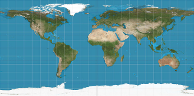
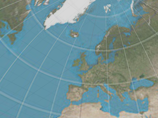
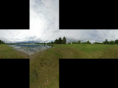
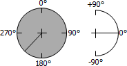
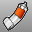

---
---

# EnvironmentEditor
{: #kanchor924}
{: #kanchor923}
{: #kanchor922}
{: #kanchor921}
{: #kanchor920}
{: #kanchor919}
 [Where can I find this command?](javascript:void(0);) Toolbars
 [Render Tools](render-tools-toolbar.html) 
Menus
Panels and Render
Environment Editor
The EnvironmentEditor command environments describe the space around the model.
Environment Editor Panel
 [Panel options](panel-options.html) 
Environments panel toolbar
The Environments panel has additional browsing tools.
Back
Walks back though the previously selected environments.
Forward
Walks forward through the previously selected environments.
Currently selected item name
Displays the current environments icon and name.
Search
Search for environments.
Menu
Displays the [Tools](environment-toolsmenu.html) menu.
Help
Thumbnail preview actions
Right-click a thumbnail to display a [context menu](environmentthumbnail-contextmenu.html) .Right-click the blank area of the thumbnail browser to display a [context menu](environmentthumbnail-blankcontextmenu.html) .Right-click and drag in the thumbnail to change the view.Double-click to display a larger preview window.Drag the preview thumbnails to reorder the list.Double-click the large preview to open a floating window that can be re-sized to get a higher resolution view of the preview.This window has all the same functionality as the original preview image including the context menu and the ability to drag and drop onto other materials or objects in the model.Right-click the large preview window or the floating preview window to display the [context menu](environmentpanel-largepreviewmenu.html).
## Creating and editing environments
To create a new environment
In the thumbnail browser, click theCreate New Environmentbutton.On the menu, select a environment type.Create New Environment
Create a new blank environment
A new blank environment is created.
Basic Environment
Creates a new [basic](#basic-settings) environment.
Import Environment from File
Imports environments from a saved Rhino .renv file.
{: #name}Name
The name of the environment.
{: #type}Type
Sets the environment type.
Basic
{: #basic-settings}Basic Environment Settings
{: #backgroundcolor}Background
The basic environment is a simple background color and optional texture. The projection of the texture can be set to either planar, spherical (otherwise known as equirectangular or longitude/latitude) or box.
To set the background color
 [Select the color](colorswatch.html) for the environment background.You can drag the color swatch to a folder to create a Rhino color file.
To add this color to a color library
Drag it from a folder to another color swatch in the [Material](materialeditor.html), [Environment](#), or [Texture Palette](texturepalette.html) panels, or you can drag it onto an object.Background image
Uses an image as the environment background.
To specify an image
Click the texture control.(click to assign texture)The check box automatically becomes checked the first time you do this.You can clear the check box to turn off the assignment.Select an image file to use.{: #mappingprojection}Projection
Sets the projection style for the background image.
Planar
Maps texture directly to background. Environment looks always the same no matter where the camera is looking.
Light probe
Also known as angular fish-eye projection or azimuthal equidistant projection. Elliptical subsection reaching each border of the texture is mapped onto the sphere.
See: [Wikipedia: Azimuthal equidistant projection](http://en.wikipedia.org/wiki/Azimuthal_equidistant_projection).
Equirectangular
Also known as spherical projection. Horizontal line in the middle of the texture is mapped to the equator of the sphere.
See: [Wikipedia: Equirectangular projection](http://en.wikipedia.org/wiki/Equirectangular_projection).

Cubemap
Subsections corresponding to each side of the cube are located side by side dividing the texture into six equal parts.
See: [Wikipedia: Cube mapping](http://en.wikipedia.org/wiki/Cube_mapping).
Vertical cross cubemap
Subsections corresponding to each side of the cube are located in a vertical cross pattern. Each subsection is one fourth of the image in height and one third in width.

Horizontal cross cubemap
Subsections corresponding to each side of the cube are located in a horizontal cross pattern. Each subsection is one third of the image in height and one fourth in width.

Emap
Elliptical subsection reaching each border of the texture is mapped onto the sphere. This projection is the result of taking a photo of a mirror sphere with an orthographic camera.
Hemispherical
Like spherical projection but the entire texture is mapped onto the upper half of the sphere. The bottom border of the texture is stretched over the under side of the sphere.
Rotation
Sets the rotation of the environment. This helps put the image in the correct position to accomplish the correct reflections and lighting.

Notes
Allows notes for the environment.

## Saving render content
Materials, environments, and textures are stored in the model, but render content can also be saved to files that can be shared between models. Content can be dragged between Rhino sessions and into a folder.
Color swatches can be dragged and dropped in the same way.
The [Libraries](libraries.html#libraries) panel displays the default content folder. Use this to drag and drop content into the model or to drag and drop model content to an external file.
Command-line options
To access command-line options
Type a hyphen in front of the command name:-EnvironmentEditor.ShowPanel
Displays theEnvironment Editorpanel.
Options
Displays command-line options.
Add
Delete
Rename
Change
Duplicate
LoadFromFile
SaveToFile
See also
 [MaterialEditor](materialeditor.html) 
Open the Material Editor to manage materials in the model.
 [TexturePalette](texturepalette.html) 
Open the Texture Editor.
 [Render](render.html) 
Render the objects using the current renderer.
&#160;
&#160;
Rhinoceros 6 © 2010-2015 Robert McNeel &amp; Associates.11-Nov-2015
 [Open topic with navigation](environmenteditor.html) 

