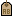

---
---

## Environment thumbnail context menu
These settings also appear on right-click context menus for the thumbnail previews and the thumbnail background.
Set as Custom Skylighting Environment
Sets the environment as a skylight environment.
Set as Custom Reflective Environment
Sets the environment as a reflective environment.
Save to File
Saves a texture to a Rhino .renv file.
Reset to Defaults
Changes all of the texture settings a blank environment.
Delete
Deletes the selected environment.
Tags
Tag textures to group or categorize environments to make searching easier.
Duplicate
Copies the selected environment to a new texture with the same settings.
Remove Instancing
Removes the connection between instanced environment.
Save as Image
Saves the selected environment as a bitmap image.
Floating Preview
Floats the preview image in a resizable window.
Show Labels
Displays thumbnail name labels when inGridmode.
Listmode always displays labels.
Show Units
Displays size in model units.
Auto-Update Preview
Automatically updates all previews as settings change.
Close
Closes the large preview window.
 [Open topic with navigation](environmentpanel-largepreviewmenu.html) 

