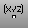

---
---

# EvaluatePt
{: #kanchor926}
{: #kanchor925}
 [Where can I find this command?](javascript:void(0);) Toolbars
 [Analyze](analyze-toolbar.html) 
Menus
Analyze
Point
The EvaluatePt command reports and optionally labels the [world](unit-systems.html#world-coordinates) and [construction plane](unit-systems.html#construction-plane-coordinates) coordinates of a selected location in space.
Steps
 [Pick](pick-location.html) a location in a viewport.The Cartesian coordinates of the location, in both world and construction plane coordinates are displayed in the [command history window](rhino-window.html#appwindow-commandhistory) in x,y,z format.Command-line options
Label
Specifies whether a leader or dot label will be added to the model.
Off
On
Style
Specifies the label style.
Dot
Labels the coordinates with an [annotation dot](dot.html).
Leader
Labels the coordinates with a [text leader](leader.html).
See also
 [Measure objects](sak-measure.html) 
&#160;
&#160;
Rhinoceros 6 © 2010-2015 Robert McNeel &amp; Associates.11-Nov-2015
 [Open topic with navigation](evaluatept.html) 

