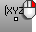

---
---

# EvaluateUVPt
{: #kanchor928}
{: #kanchor927}
 [Where can I find this command?](javascript:void(0);) Toolbars
 [Analyze](analyze-toolbar.html)  [Surface Analysis](surface-analysis-toolbar.html) 
Menus
Analyze
Surface
UV Coordinates of a Point
The EvaluateUVPt command reports the u and v&#160;coordinates of a selected location on a surface.
Steps
 [Select](select-objects.html) a surface to evaluate. [Pick](pick-location.html) a point to evaluate on the surface.When you select a [polysurface](polysurface.html), Rhino calculates the result for the component surface at the location you pick.If the surface is trimmed, Rhino uses the untrimmed surface.Command-line options
CreatePoint
Creates a point object on the surface.
Normalized
Yes
The u and v&#160;parameter ranges are scaled so that the output values are between zero and one (rather than using the real parameter value).
This is useful when you want to know the percentage along parameter space of the point you pick without having to calculate it based on the domain of the surface.
No
The unscaled u and v&#160;parameter values are given.
See: [Domain](domain.html).
See also
 [Analyze objects](sak-analysis.html) 
&#160;
&#160;
Rhinoceros 6 © 2010-2015 Robert McNeel &amp; Associates.11-Nov-2015
 [Open topic with navigation](evaluateuvpt.html) 

