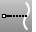
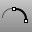
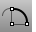
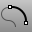
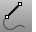
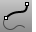

---
---

# Extend toolbar
{: #kanchor2328}
 [To open a toolbar](javascript:void(0);) Toolbars can be opened as a free-standing group or added to the current group.
To open a toolbar as a free-standing group
Click theOptionsicon in any toolbar group.On the menu, clickShow Toolbar, and then select the toolbar name from the list.To open a toolbar as a new tab in the current group
Click theOptionsicon in the toolbar group where you want to add the new tab.On the menu, clickShow or Hide Tabs, and then select the toolbar name from the list. [Connect](connect.html) 
Extend and trim curves to meet at their endpoints.
 [Extend](extend.html) 
Lengthen a curve.
 [Extend, *Arc* ](extend.html#arc) 
Lengthen a curve with an arc keeping radius.
 [Extend, *Arc, Center* ](extend.html#arc-center) 
Lengthen a curve with an arc from center.
 [Extend, *Arc, ToPoint* ](extend.html#arc-topoint) 
Lengthen a curve with an arc to a point.
 [Extend, *Line* ](extend.html#line) 
Lengthen a curve with a line.
 [Extend, *Smooth* ](extend.html#smooth) 
Lengthen a curve smoothly.
 [ExtendCrvOnSrf](extendcrvonsrf.html) 
Lengthen a curve on a surface to the surface edges.
&#160;
&#160;
Rhinoceros 6 © 2010-2015 Robert McNeel &amp; Associates.11-Nov-2015
 [Open topic with navigation](extend-toolbar.html) 

