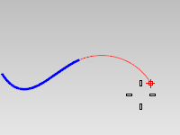
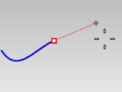
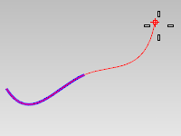

---
---

# Extend
{: #kanchor950}
{: #kanchor949}
{: #kanchor948}
{: #kanchor947}
{: #kanchor946}
{: #kanchor945}
{: #kanchor944}
 [Where can I find this command?](javascript:void(0);) Toolbars
 [Curve Tools](curve-tools-toolbar.html)  [Extend](extend-toolbar.html) 
Menus
Curve
Extend Curve
Extend Curve
By Line
By Arc
By Arc with Center
By Arc to Point
Curve on Surface
The Extend command lengthens or shortens a curve.
Steps
 [Select](select-objects.html) a boundary object, type a length, or press [Enter](enter-key.html) to extend without boundary edges.Your browser does not support the video tag.Your browser does not support the video tag.Select a curve or an surface edge near the end.The extension will be automatically joined with the original curve.To extend to multiple objects, pick the end of the curve again to extend the curve beyond the first boundary to the next.Your browser does not support the video tag.Pick the end of the extension or type a length.Note
You can use any combination of curves, surfaces, and solids as boundary edges.If you want to extend two curves to meet each other simultaneously, use the [Connect](connect.html) command.Command-line options
ToPoint
 [Pick a location](pick-location.html) to extend the curve to.
Type
Natural
Lines, polylines, and [polycurves](polycurve.html) with a line at the end to extend are extended by line.
Arcs and [polycurves](polycurve.html) with arc at the end to extend are extended by same radius arc.
Other curves are extended smooth.
{: #arc}Arc
Makes an arc extension tangent to the original curve.

Arc Options
{: #arc-center}{: #center}Center
Extends a curve with an arc by picking the arc's center and endpoint.
Center steps
Pick the arc's center point.Pick the arc's end point.{: #arc-topoint}ToPoint
Extends a curve with an arc by picking the arc's endpoint.
ToPoint steps
Pick the arc's end point.{: #line}Line
Makes a line extension tangent to the original curve.

{: #smooth}Smooth
Makes a smooth curve extension [curvature continuous](continuity-descriptions.html) with the original curve.

Smooth option
ToPoint
Extends a curve smoothly by picking the curve's endpoint.
ToPoint steps
Pick the curve's end point.Undo
The Undo option reverses the last action.
See also
 [Extend curves and surfaces](sak-extend.html) 
&#160;
&#160;
Rhinoceros 6 © 2010-2015 Robert McNeel &amp; Associates.11-Nov-2015
 [Open topic with navigation](extend.html) 

