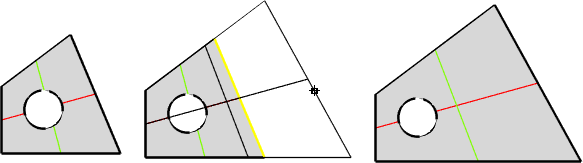
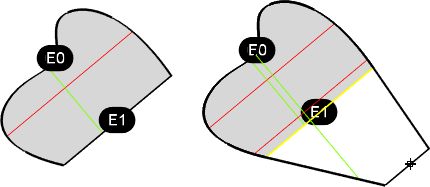
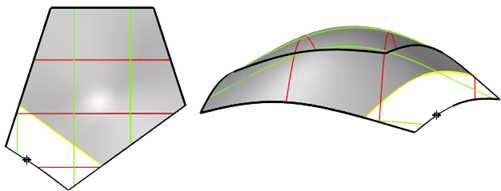
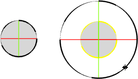
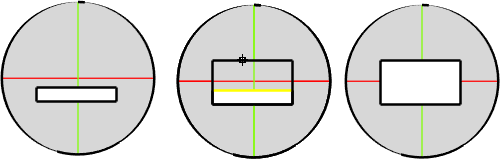
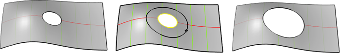

---
---

# ExtendSrf
{: #kanchor955}
{: #kanchor954}
{: #kanchor953}
 [Where can I find this command?](javascript:void(0);) Toolbars
 [Surface Tools](surface-tools-toolbar.html) 
Menus
Surface
Extend Surface
&#160; [Crease splitting enabled](creasesplttingenabled.html) 
The ExtendSrf command moves a surface edge to lengthen a surface.
If the surface edges is trimmed, a preview of the extension displays.
Steps
 [Select](select-objects.html) a trimmed or untrimmed surface edge. [Specify a distance](distance-pick-2pts.html) .Your browser does not support the video tag.Command-line options
Type
Smooth
Extends the surface smoothly curving from the edge.
Line
Extends the surface in a straight line from the edge.
Note
You can pick on an edge and drag it in or out to where you want the edge.You can also type negative number for the distance to "shrink" the surface.The distance is on the surface.Examples of extending surfaces

See also
 [Extend curves and surfaces](sak-extend.html) 
&#160;
&#160;
Rhinoceros 6 © 2010-2015 Robert McNeel &amp; Associates.11-Nov-2015
 [Open topic with navigation](extendsrf.html) 

