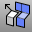

---
---

# Extract Mesh toolbar
{: #kanchor2329}
 [To open a toolbar](javascript:void(0);) Toolbars can be opened as a free-standing group or added to the current group.
To open a toolbar as a free-standing group
Click theOptionsicon in any toolbar group.On the menu, clickShow Toolbar, and then select the toolbar name from the list.To open a toolbar as a new tab in the current group
Click theOptionsicon in the toolbar group where you want to add the new tab.On the menu, clickShow or Hide Tabs, and then select the toolbar name from the list. [Cancel](cancel.html) 
Cancel the current command and deselects objects.
 [Cancel, *All* ](cancel.html) 
Turns off [Points](pointson.html), [CurvatureGraph](curvaturegraph.html), [EMap](emap.html), [Zebra](zebra.html), [MoveUVN](moveuvn.html), [CurvatureAnalysis](curvatureanalysis.html), and deselects objects.
 [ExtractMeshFaces](extractmeshfaces-commands.html) 
Separate faces from a mesh.
 [ExtractConnectedMeshFaces](extractmeshfaces-commands.html#extractconnectedmeshfaces) 
Separate mesh faces connected to a face.
 [ExtractDuplicateMeshFaces](extractmeshfaces-commands.html#extractduplicatemeshfaces) 
Separate duplicated faces from a mesh.
 [ExtractMeshFacesByAspectRatio](extractmeshfaces-commands.html#extractmeshfacesbyaspectratio) 
Separate faces from a mesh by aspect ratio.
 [ExtractMeshFacesByArea](extractmeshfaces-commands.html#extractmeshfacesbyarea) 
Separate faces from a mesh by area.
 [ExtractMeshFacesByDraftAngle](extractmeshfaces-commands.html#extractmeshfacesbydraftangle) 
Separate faces from a mesh by a draft angle or weld status.
 [ExtractMeshPart](extractmeshfaces-commands.html#extractmeshpart) 
Separate faces from a mesh that are bounded by unwelded edges.
 [ExtractMeshEdges](extractmeshedges.html) 
Separate faces from the parent mesh determined by a draft angle or weld status.
 [Move](move.html) 
Move objects from one location to another.
Link to [Transform toolbar](transform-toolbar.html) 
&#160;
&#160;
Rhinoceros 6 © 2010-2015 Robert McNeel &amp; Associates.11-Nov-2015
 [Open topic with navigation](extract-mesh-toolbar.html) 

