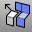
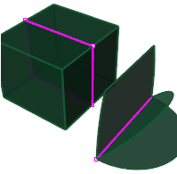

---
---

# ExtractMeshEdges
{: #kanchor975}
 [Where can I find this command?](javascript:void(0);) Toolbars
 [Extract Mesh](extract-mesh-toolbar.html) 
Menus
 [Not on menus.](menuwhattodo.html) 
The ExtractMeshEdges command separates edges from the parent mesh determined by an angle between mesh face normals.
The command may help if you have a mesh that came from a polysurface but no longer have the polysurface. Using the command with theUnweldedoption creates polyline approximations of where the edges of the polysurface were.
Note
Some STL/SLA printers have problems if meshes contain many long, thin facets. These can slow the printer's slicing process down, produce odd printed results, and run the printer out of memory.The [MeshRepair](meshrepair.html) command may be useful when tuning up meshes for STL/SLA printing.Steps
 [Select](select-objects.html) a mesh.Command-line options
Extract edges by
Unwelded
Extracts edges with coincident vertices.
Break angle
The angle between the face normals of adjacent faces.
Greater than
Specify a minimum break angle.
Select Edge
Specify an example edge to set the minimum break angle.
Less than
Specify a maximum break angle
Select Edge
Specify an example edge to set the maximum break angle.
Join results
Joins the resulting curves.

# ExtractNonManifoldMeshEdges
{: #kanchor977}
{: #kanchor976}
{: #extractnonmanifoldmeshedges}
 [Where can I find this command?](javascript:void(0);) Toolbars
 [Not on toolbars.](toolbarwhattodo.html) 
Menus
 [Not on menus.](menuwhattodo.html) 
The ExtractNonManifoldMeshEdges command separates from the parent mesh non-manifold faces.
Nonmanifold edges
Edges of polysurfaces or meshes that have more than two faces joined to a single edge are non-manifold.
The illustration shows polysurfaces with non-manifold edges highlighted with the [ShowEdges](showedges.html) command.

Steps
 [Select](select-objects.html) a mesh.Note
Some STL/SLA printers have problems if meshes contain many long, thin facets. These can slow the printer's slicing process down, produce odd printed results, and run the printer out of memory.The [MeshRepair](meshrepair.html) command may be useful when tuning up meshes for STL/SLA printing.See also
 [Collapse mesh faces and vertices](sak-collapsemesh.html) 
&#160;
&#160;
Rhinoceros 6 © 2010-2015 Robert McNeel &amp; Associates.11-Nov-2015
 [Open topic with navigation](extractmeshedges.html) 

