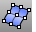

---
---

# ExtractPt
{: #kanchor982}
{: #kanchor981}
{: #kanchor980}
{: #kanchor979}
 [Where can I find this command?](javascript:void(0);) Toolbars
 [Point](point-toolbar.html)  [Curve From Object](curve-from-object-toolbar.html) 
Menus
Curve
Curve From Objects
Extract Points
The ExtractPt command places [point objects](point.html) at curve [control points](pointson.html) or [edit point](pointson.html#editpton) locations, surface and text control point locations, and polygon mesh vertices.
Steps
 [Select](select-objects.html) curves, surfaces, or polygon mesh objects.Rhino creates point objects for every control point in the object.Your browser does not support the video tag.To extract selected points only
Turn on the [control points](pointson.html) or the [edit points](pointson.html#editpton) on an object. [Select](select-objects.html) the control or edit points to duplicate.Command-line options
OutputLayer
Specifies the layer for the results of the command.
Current
Places the results on the current layer.
Input
Places the results on the same layer as the input curve.
TargetObject
Places the results on the same layer as the target surface.
See also
 [Extract object sub-elements](sak-extract.html) 
&#160;
&#160;
Rhinoceros 6 © 2010-2015 Robert McNeel &amp; Associates.11-Nov-2015
 [Open topic with navigation](extractpt.html) 

