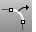

---
---

# ExtractSubCrv
{: #kanchor990}
 [Where can I find this command?](javascript:void(0);) Toolbars
 [Curve Tools](curve-tools-toolbar.html) 
Menus
Curve
Curve From Objects
Extract Curve
The ExtractSubCrv command separates or copies [polycurve](polycurve.html) segments.
Steps
 [Select](select-objects.html) a [polycurve](polycurve.html) .Select curve segments.Your browser does not support the video tag.To remove a curve from the selection
Press [Ctrl](ctrl-key.html) while clicking.Command-line options
Copy
The Copy option specifies whether or not the objects are copied. A plus signappears at the cursor when copy mode is on.
The [RememberCopyOptions](remembercopyoptions.html) command determines whether the selected option is used as the default.
Join
Joins the resulting curves.
OutputLayer
Specifies the layer for the results of the command.
Current
Places the results on the current layer.
Input
Places the results on the same layer as the input curve.
TargetObject
Places the results on the same layer as the target surface.
See also
 [Extract object sub-elements](sak-extract.html) 
&#160;
&#160;
Rhinoceros 6 © 2010-2015 Robert McNeel &amp; Associates.11-Nov-2015
 [Open topic with navigation](extractsubcrv.html) 

