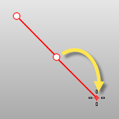

---
---

# ExtrudeSrf
{: #kanchor1003}
{: #kanchor1002}
 [Where can I find this command?](javascript:void(0);) Toolbars
 [Extrude Solid](extrude-solid-toolbar.html)  [Solids Sidebar](solids-sidebar-toolbar.html)  [Solid Tools](solid-tools-toolbar.html)  [Solids Creation](solid-creation-toolbar.html)  [Solid Editing](solid-editing-toolbar.html) 
Menus
Solid
Extrude Surface
Straight
 [&#160;History enabled](historyenabled.html) 
&#160; [Extrusions enabled](extrusionsenabled.html) 
The ExtrudeSrf command creates a solid by tracing the path of the surface edges in a straight line.
Steps
 [Select](select-objects.html) a surface. [Specify a distance](distance-pick-2pts.html) .Your browser does not support the video tag.Note
If the curve is not planar, then it will be extruded in the z&#160;direction of the active viewport's construction plane. If the curve is planar, it will be extruded in the normal direction of the plane of the curve.Unlike [Lofts](loft.html) and [Sweeps](sweep1.html), the initial orientation of the profile curve or surface is maintained through the extrusion.If the input is a non-planar polycurve or a planar polycurve where the extrusion direction is not normal to the curve plane, the result will be a [polysurface](polysurface.html) rather than an [extrusion object](useextrusions.html) .Command-line options
SetBasePoint
Specify a location that serves as the first point when picking two points that set the extrusion distance.
Direction
Two points establish the direction angle.
Direction steps
 [Pick](pick-location.html) a base point.Pick a second point that establishes the direction angle.BothSides
The BothSides option draws the object on both sides of the start point, creating the object twice as long as you indicate.

The BothSides option demonstrated with the [Line](line.html) command.
Solid
If the profile curve is closed and planar, both ends of the extruded object are filled with planar surfaces and joined to make a closed polysurface.
DeleteInput
Yes
Deletes the original geometry.
No
Retains the original geometry.
ToBoundary
Extrudes the object to a boundary surface.
See also
 [Extrude curves and surfaces](sak-extrude.html) 
&#160;
&#160;
Rhinoceros 6 © 2010-2015 Robert McNeel &amp; Associates.11-Nov-2015
 [Open topic with navigation](extrudesrf.html) 

