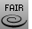

---
---

# Fair
{: #kanchor1011}
{: #kanchor1010}
 [Where can I find this command?](javascript:void(0);) Toolbars
 [Curve Tools](curve-tools-toolbar.html) 
Menus
Curve
Curve Edit Tools
Fair
The Fair command removes large curvature variations in a curve while limiting the geometry changes to the specified tolerance.
Steps
 [Select](select-objects.html) curves.Type a new tolerance value or press [Enter](enter-key.html) .Note
TheFaircommand works best on [degree](degree.html) -3 curves.Sometimes you must run theFaircommand several times in order to remove curvature problems.You can use the [CurvatureGraph](curvaturegraph.html) command to view the curvature hair while fairing.See also
 [Edit curves](sak-curvetools.html) 
&#160;
&#160;
Rhinoceros 6 © 2010-2015 Robert McNeel &amp; Associates.11-Nov-2015
 [Open topic with navigation](fair.html) 

