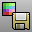
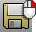

---
---

# File toolbar
{: #kanchor2332}
 [To open a toolbar](javascript:void(0);) Toolbars can be opened as a free-standing group or added to the current group.
To open a toolbar as a free-standing group
Click theOptionsicon in any toolbar group.On the menu, clickShow Toolbar, and then select the toolbar name from the list.To open a toolbar as a new tab in the current group
Click theOptionsicon in the toolbar group where you want to add the new tab.On the menu, clickShow or Hide Tabs, and then select the toolbar name from the list. [Autosave](autosave.html) 
Save the current model to a backup file.
 [DocumentProperties](documentproperties.html) 
Manage the settings for the current model.
 [ExportBitmaps](exportbitmaps.html) 
Create files from bitmaps in the model.
 [ExportWithOrigin](export.html#exportwithorigin) 
Save objects to a new file with a specified origin and construction plane.
 [IncrementalSave](save.html#incrementalsave) 
Save sequentially-numbered versions of a model.
 [Insert](insert.html) 
Insert block objects stored in the file or import a file as a block definition.
 [New](new.html) 
Create a new model based on a template.
 [Notes](notes.html) 
Open a text notes window.
 [Open](open.html) 
Open an existing model file.
 [Import](import.html) 
Merge objects from another model file.
 [Print](print.html) 
Print the current viewport or layouts.
 [Save](save.html) 
Save the current model.
 [Export](export.html) 
Save selected objects to a new file.
 [SaveAs](save.html#saveas) 
Save the current model with a different name, close the current model, and open the new model.
 [SaveAsTemplate](save.html#saveastemplate) 
Save the current model as a template file.
 [SaveSmall](save.html#savesmall) 
Save geometry objects without render or analysis meshes.
 [Save geometry only](save.html#save-geometry-only) 
Saves geometry objects only. No layers, materials, properties, notes, or units settings are saved.
This is similar to exporting the objects. A new file is made, but it does not become your active Rhino model.
 [SetWorkingFolder](setworkingfolder.html) 
Specify the default folder for saving and opening files.
 [Worksession, *Attach* ](worksession.html#attach) 
Adds a model to the worksession list.
Link to [Worksession toolbar](worksession-toolbar.html).
 [Worksession](worksession.html) 
Manage a list of models that can be used as reference geometry.
&#160;
&#160;
Rhinoceros 6 © 2010-2015 Robert McNeel &amp; Associates.11-Nov-2015
 [Open topic with navigation](file-toolbar.html) 

