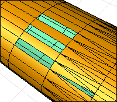
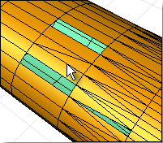
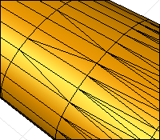

---
---

# FillMeshHole
{: #kanchor1027}
{: #kanchor1026}
 [Where can I find this command?](javascript:void(0);) Toolbars
 [Mesh Tools](mesh-tools-toolbar.html) 
Menus
Mesh
Mesh Repair Tools
Fill Hole
The FillMeshHole command fills a selected hole in a mesh.
This helps repair mesh files for rapid prototype printing.

Steps
 [Select](select-objects.html) a mesh hole boundary.Command-line option
JoinMesh
Joins the new faces to the original mesh.

# FillMeshHoles
{: #kanchor1029}
{: #kanchor1028}
{: #fillmeshholes}
 [Where can I find this command?](javascript:void(0);) Toolbars
 [Mesh Tools](mesh-tools-toolbar.html) 
Menus
Mesh
Mesh Repair Tools
Fill Holes
The FillMeshHoles command fills all holes in a polygon mesh object with triangular faces.
This helps repair mesh files for rapid prototype printing.

Steps
 [Select](select-objects.html) mesh objects.See also
 [Edit mesh objects](sak-meshtools.html) 
 [White paper: Scan, Cleanup, Remodel](http://download.rhino3d.com/download.asp?id=ScanCleanupRemodel) 
&#160;
&#160;
Rhinoceros 6 © 2010-2015 Robert McNeel &amp; Associates.11-Nov-2015
 [Open topic with navigation](fillmeshhole.html) 

