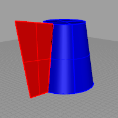
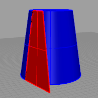

---
---

# Fin
{: #kanchor1031}
{: #kanchor1030}
 [Where can I find this command?](javascript:void(0);) Toolbars
 [Extrude](extrude-toolbar.html)  [Surface Creation](surface-creation-toolbar.html)  [Surface Sidebar](surface-sidebar-toolbar.html) 
Menus
Surface
Extrude Curve
Normal to Surface
The Fin command extrudes a curve on a surface in the surface normal direction or tangent to the surface.
Steps
 [Select](select-objects.html) a curve on the surface.Select the surface.Infinite Plane: TypeIPfor [InfinitePlane](infiniteplane.html) options.
 [Pick](pick-location.html) a location on the curve for a height.Pick location to set another height, or press [Enter](enter-key.html) if the surface should be uniform in height.Your browser does not support the video tag.Command-line options
SetBasePoint
Specify a location that serves as the first point when picking two points that set the extrusion distance.
Direction
Normal
Creates the surface in the [surface normal direction](dir.html#normaldirection).

Tangent
Creates the surface tangent to the surface.

See also
 [Extrude curves and surfaces](sak-extrude.html) 
&#160;
&#160;
Rhinoceros 6 © 2010-2015 Robert McNeel &amp; Associates.11-Nov-2015
 [Open topic with navigation](fin.html) 

