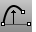

---
---

{: #kanchor1037}
# FixedLengthCrvEdit
 [Where can I find this command?](javascript:void(0);) Toolbars
 [Move](move-toolbar.html) 
Menus
 [Not on menus.](menuwhattodo.html) 
The FixedLengthCrvEdit command allows dragging points on a curve to change its shape without changing the curve's length.
Steps
 [Select](select-objects.html) a curve.Pick a point on the curve.Pick a point to move to.Press [Enter](enter-key.html) to end the command.Your browser does not support the video tag.Command-line option
Copy
The Copy option specifies whether or not the objects are copied. A plus signappears at the cursor when copy mode is on.
The [RememberCopyOptions](remembercopyoptions.html) command determines whether the selected option is used as the default.
See also
 [Edit curves](sak-curvetools.html) 
&#160;
&#160;
Rhinoceros 6 © 2010-2015 Robert McNeel &amp; Associates.11-Nov-2015
 [Open topic with navigation](fixedlengthcrvedit.html) 

