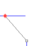
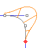
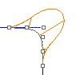
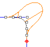
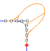

---
---

{: #kanchor1051}{: #kanchor1052}{: #kanchor1053}{: #kanchor1054}
# GCon
 [Where can I find this command?](javascript:void(0);) Toolbars
 [Analyze](analyze-toolbar.html) 
Menus
Analyze
Curve
Geometric Continuity
The GCon command reports the geometric continuity between two curves.
Steps
 [Select](select-objects.html) the first curve near the end that coincides with the end of another curve.Select the second curve near the coinciding end.Tangency and curvature continuity information display on the command line.
## Continuity
Position (G0)

Position (G0 continuity) measures location only. If the end points of each curve are in the same location in space, the curves are position continuous (G0) at the ends. In other words, the two curves in question touch each other at their end points.
Tangency (G1)

Tangency (G1 continuity) measures position and curve direction at the ends. in other words, the two curves not only touch, but they go the same direction at the point where they touch.
The direction is determined by the first and second point on each curve. If these two points fall on a line, the two curves are tangent at the ends.
The first derivative of the two curves is equal at the point where they touch.
Curvature (G2)

Curvature continuity (G2 continuity) between two curves measures position, direction, and radius of curvature at the ends. If the radius of curvature is the same at the common end point, curves are curvature continuous (G2). In other words, the curves not only go the same direction when they meet, but also have the same radius at that point. This condition is not easy to determine by just looking at where the points are located.
Both the first and second derivatives of the equations are equal at that point.
G3

G3 continuity adds a third requirement: planar acceleration. Curves that are G3 continuous touch, go the same direction, have the same radius, and that radius is accelerating at the same rate at a certain point.
G3 continuous curves have equal third derivatives.
G4

G4 continuity is very seldom used, but can be important in certain isolated cases. G4 continuous curves have all the same requirements as G3 curves, but their curvature acceleration is equal in three dimensions.
See also
 [Analyze objects](sak-analysis.html) 
 [Geometric continuity](http://en.wikipedia.org/wiki/Geometric_continuity) 
&#160;
&#160;
Rhinoceros 6 © 2010-2015 Robert McNeel &amp; Associates.11-Nov-2015
 [Open topic with navigation](gcon.html) 

