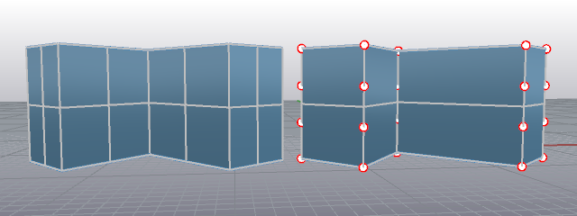
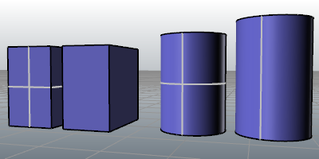

---
---

{: #kanchor2716}{: #kanchor2717}{: #kanchor2718}{: #kanchor2719}{: #kanchor2720}{: #kanchor2721}{: #kanchor2722}{: #kanchor2723}{: #kanchor2724}{: #kanchor2725}{: #kanchor2726}{: #kanchor2727}
# General
 [Where can I find this command?](javascript:void(0);) Toolbars
 [Properties](properties-toolbar.html)  [Standard](standard-toolbar.html)  [Tools](tools-toolbar.html) 
Menus
Tools
Options
The General options control menu functions, undo, and start-up commands.
General
Most-recently-used commands pop-up menu
When you right-click in the command area, or program your [middle mouse button](mouse.html#middle-mouse-button) to display the recently-used commands menu, a menu displays at the cursor location containing a list of recently-used commands and the commands you have Entered as your favorites.
Limit list to ___ commands
This allows you to choose the maximum number of items that can appear in the most-recently-used command lists.
Show these commands at the top of the menu
Your favorite commands will always display in the pop-up menu at the top of the pop-up menu above the most-recently-used commands.
Command Lists
Run these commands every time Rhino starts
Defines a list of commands that will run automatically whenever you start Rhino.
Never repeat these commands
Defines a list of commands that will not repeat when you press [Enter](enter-key.html).
Only command names can be flagged as do-not-repeat. If a command is in a macro, it will repeat even if it is on this list.
Undo
Max memory used (MB)
The maximum amount of memory Rhino will attempt to use.
Default surface isocurve density
Show surface isocurves
Sets the display of surface [isoparametric curves](isocurve.html) for new objects.
Isocurve density
Defines the default surface [isoparametric curves](isocurve.html) density for new objects.
Value
Isocurve density
0
No isocurves on knot-free spans.
1
One isocurve at each knot, or one isocurve on knot-free spans.
2
One isocurve at each knot, plus one isocurve between knot locations.
3
One isocurve at each knot, plus two isocurves between knot locations.
Command behavior
Remember Copy=Yes/No options
TheRemember Copy Optionsoption specifies whetherCopyoption on transform commands is stored or not.
See: [RememberCopyOptions](remembercopyoptions.html) 
Split creased surfaces into polysurfaces
When curves have [kinks](kink.html), surfaces made with those curves as input can have creases. TheSplit creased surfaces into polysurfacesoption controls whether commands that make surfaces from kinked curves divide resulting surfaces into polysurfaces with edges at the creases or into single surfaces with creases.
See: [CreaseSplitting](creasesplitting.html) 
Use extrusions when possible
Controls whether extrusion objects or polysurfaces are created by commands like [Box](box.html), [Cylinder](cylinder.html), [ExtrudeCrv](extrudecrv.html), [Pipe](pipe.html), and [Slab](slab.html) that create straight-sided objects.
 [See UseExtrusions](useextrusions.html) 
To save options for use on other computers
 [OptionsExport](optionsexport.html) 
Save [Options](options.html) settings to a file.
 [OptionsImport](optionsexport.html#optionsimport) 
Restore [Options](options.html) settings from a file.
See also
 [Options](options.html) 
Manage global options: [3D mouse](3dconnexion.html), [alerter](alerter.html), [aliases](aliases.html), [appearance](appearance.html), [context menu](context-menu.html), [display modes](view-displaymode-options.html), [files](files.html), [general](#), [idle processor](idleprocessor.html), [keyboard](keyboard.html), [libraries](libraries.html), [licenses](licenses.html), [modeling aids](modeling-aids.html), [mouse](mouse.html), [plug-ins](plug-ins.html), [render](rendering.html), [RhinoScript](rhinoscript.html), [selection menu](selection-menu.html), [toolbars](toolbars.html), [updates and statistics](updates-and-statistics.html), [view](view.html).

# Related commands

## CreaseSplitting
{: #kanchor2728}
{: #creasesplitting}
 [Where can I find this command?](javascript:void(0);) Toolbars
 [Properties](properties-toolbar.html)  [Standard](standard-toolbar.html)  [Tools](tools-toolbar.html) 
Menus
Tools
Options
General
When curves have [kinks](kink.html), surfaces made with those curves as input can have creases. TheCreaseSplittingcommand controls whether commands that make surfaces from kinked curves divide resulting surfaces into polysurfaces with edges at the creases or into single surfaces with creases.
When the input curve has a [kink](kink.html), the resulting surface will have a crease.

CreaseSplitting=Yes (left); CreaseSplitting=No (right).Loft results with control points on. The object at the left is a polysurface; turning on control points is not allowed.
Command-line options
SplitAlongCreases
Determines whether the result will be a polysurface with edges at creases or a single surface with creases where the input curves had kinks.

## Commands affected
 [DeleteHole](deletehole.html) 
Delete a hole from a polysurface and remake the surface.
 [ExtendSrf](extendsrf.html) 
Lengthen a surface by a value.
 [Loft](loft.html) 
Fit a surface through profile curves that define the surface shape.
 [MatchSrf](matchsrf.html) 
Adjust a surface edge to have continuity with another surface edge.
 [RailRevolve](railrevolve.html) 
Revolve a profile curve around an axis and along a rail curve.
 [Revolve](revolve.html) 
Create a surface by revolving a profile curve around an axis.
 [Sweep1](sweep1.html) 
Fit a surface through profile curves and one edge curve.
 [Sweep2](sweep2.html) 
Fit a surface through profile curves and two edge curves.
 [Untrim](trim.html#untrim) 
Remove trim curves from trimmed surfaces.
 [UntrimAll](trim.html#untrimall) 
Untrim all edges.

## RememberCopyOptions
{: #remembercopyoptions}
 [Where can I find this command?](javascript:void(0);) Toolbars
 [Properties](properties-toolbar.html)  [Standard](standard-toolbar.html)  [Tools](tools-toolbar.html) 
Menus
Tools
Options
General
The RememberCopyOptions command specifies whether Copy option on transform commands is stored or not.
Commands affected
 [Bend](bend.html) 
 [ExtractSrf](extractsrf.html) 
 [ExtractSubCrv](extractsubcrv.html) 
 [FixedLengthCrvEdit](fixedlengthcrvedit.html) 
 [Flow](flow.html) 
 [FlowAlongSrf](flowalongsrf.html) 
 [Maelstrom](maelstrom.html) 
 [Mirror](mirror.html) 
 [MirrorHole](mirrorhole.html) 
 [ModifyRadius](modifyradius.html) 
 [MoveCrv](movecrv.html) 
 [MoveHole](movehole.html) 
 [MoveUntrimmedEdge](moveuntrimmededge.html) 
 [MoveUntrimmedFace](moveuntrimmedface.html) 
 [Orient](orient.html) 
 [Orient3Pt](orient3pt.html) 
 [OrientCrvToEdge](orientcrvtoedge.html) 
 [OrientOnCrv](orientoncrv.html) 
 [OrientOnSrf](orientonsrf.html) 
 [RemapCPlane](remapcplane.html) 
 [RemoveFromGroup](group.html#removefromgroup) 
 [RemapCPlane](remapcplane.html) 
 [RemoveFromGroup](group.html#removefromgroup) 
 [Rotate](rotate.html) 
 [Rotate3D](rotate3d.html) 
 [RotateHole](rotatehole.html) 
 [Scale](scale.html) 
 [Scale1D](scale1d.html) 
 [Scale2D](scale2d.html) 
 [ScaleByPlane](scalebyplane.html) 
 [ScaleNU](scalenu.html) 
 [SetPt](setpt.html) 
 [Shear](shear.html) 
 [SoftEditCrv](softeditcrv.html) 
 [SoftEditSrf](softeditsrf.html) 
 [SoftMove](softmove.html) 
 [Splop](splop.html) 
 [Taper](taper.html) 
 [Twist](twist.html) 

## UseExtrusions
{: #kanchor2729}
{: #useextrusions}
 [Where can I find this command?](javascript:void(0);) Toolbars
 [Not on toolbars.](toolbarwhattodo.html) 
Menus
 [Not on menus.](menuwhattodo.html) 
The UseExtrusions command controls whether extrusion objects or polysurfaces are created by commands like [Box](box.html), [Cylinder](cylinder.html), [ExtrudeCrv](extrudecrv.html), [Pipe](pipe.html), and [Slab](slab.html) that create straight-sided objects.
Extrusion objects are defined by a profile curve and a straight line. They use less memory and mesh faster. They are a good option when making models containing lots of simple shapes.

Polysurface (left) vs. extrusion object (right).
Steps
 [Specify](specifycommandlineoption.html) the planar extrusion output object type you want to use.A report on the internal data structure of the object displays.Command-line options
Extrusion
Commands uses light-weight extrusion object when possible.
Polysurface
Commands always create polysurfaces.
Commands with extrusions enabled
Commands with the button below near the top of the topic can use extrusions.
&#160; [Extrusions enabled](extrusionsenabled.html) 
These commands can make use of lightweight extrusions:
 [Box](box.html)  [Cylinder](cylinder.html)  [ExtrudeCrv](extrudecrv.html)  [ExtrudeSrf](extrudesrf.html)  [Pipe](pipe.html)  [Slab](slab.html)  [Tube](tube.html) 
# ConvertExtrusion
{: #kanchor2730}
{: #convertextrusion}
 [Where can I find this command?](javascript:void(0);) Toolbars
 [Not on toolbars.](toolbarwhattodo.html) 
Menus
 [Not on menus.](menuwhattodo.html) 
The ConvertExtrusion command converts extrusion objects to surfaces and polysurfaces.
Steps
 [Select](select-objects.html) extrusion objects.Command-line options
DeleteInput
Yes
Deletes the original geometry.
No
Retains the original geometry.
See also
 [Create surfaces](sak-surface.html) 
 [Edit surfaces](sak-surfacetools.html) 
 [Extrude curves and surfaces](sak-extrude.html) 
 [Utility functions](sak-utilities.html) 
&#160;
&#160;
Rhinoceros 6 © 2010-2015 Robert McNeel &amp; Associates.11-Nov-2015
 [Open topic with navigation](general.html) 

