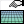
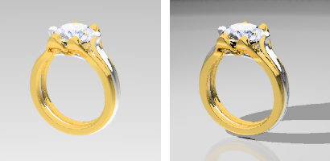

---
---

{: #kanchor1089}{: #kanchor1090}
# GroundPlane
 [Where can I find this command?](javascript:void(0);) Toolbars
 [Render Tools](render-tools-toolbar.html) 
Menus
Panels and Render
Ground Plane
The GroundPlane command opens the Ground Plane panel.
The ground plane provides an infinite horizontal platform for the image that stretches to the horizon in all directions positioned at a defined elevation. A ground plane renders much faster than using a surface as a background. Any material can be assigned to the ground plane.
The ground plane does not display in [Technical](view-displaymode-options.html#technical) or [Wireframe](view-displaymode-options.html#wireframe) display modes.

Without ground plane (left), with ground plane (right).
Ground Plane Panel
 [Panel options](panel-options.html) 
On
Turns on the ground plane.
Show underside
Allows the "back" of the ground plane to be visible when viewed from below. Otherwise, the underside is transparent
Height above world XY plane
Sets the ground plane's height above the xy&#160;plane.
Automatic
Places the ground plane just below the lowest element in the model. As new objects are added to the scene, the ground plane can move.
Material
Assigns a material to the ground plane.
Shadow only
Makes the ground plane transparent, but allows shadows to still be cast on it.
For information on setting a material, see [Material Editor](materialeditor.html).
Texture mapping
These settings apply when a texture applied to the ground plane.
X/Y Offset (units)
Specifies the offset distance in units from 0,0,0.
X/Y Size (units)
Specifies the size in units of the texture.
Rotation
Specifies the rotation angle of the texture from 0.
Command-line options
To access hidden command-line options
Type ahyphenin front of the command name:-GroundPlane.ShowPanel
Options
On
ShowUnderside=Off/On
AutomaticAltitude=Off/On
ShadowOnly=Off/On
Altitude=0
SetMaterial
Instance ID or Instance name
See also
 [Render](render.html) 
Render the objects using the current renderer.
&#160;
&#160;
Rhinoceros 6 © 2010-2015 Robert McNeel &amp; Associates.11-Nov-2015
 [Open topic with navigation](groundplane.html) 

