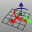
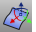
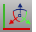
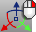
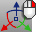
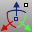

---
---

# Gumball toolbar
{: #kanchor2335}
 [To open a toolbar](javascript:void(0);) Toolbars can be opened as a free-standing group or added to the current group.
To open a toolbar as a free-standing group
Click theOptionsicon in any toolbar group.On the menu, clickShow Toolbar, and then select the toolbar name from the list.To open a toolbar as a new tab in the current group
Click theOptionsicon in the toolbar group where you want to add the new tab.On the menu, clickShow or Hide Tabs, and then select the toolbar name from the list. [Align Gumball to CPlane](gumball.html#gumballalignment) 
Aligns the gumball widget to the current construction plane.
 [Align Gumball to Object](gumball.html#gumballalignment) 
Aligns the gumball widget to the object.
 [Align Gumball to World](gumball.html#gumballalignment) 
Aligns the gumball widget to world coordinates.
 [Gumball drag strength: 50%](dragmode.html#dragstrength) 
Sets the gumball widget drag strength to 50%.
 [Gumball drag strength: 100%](dragmode.html#dragstrength) 
Sets the gumball widget drag strength to 100%.
 [Relocate the gumball widget](gumball.html#gumballrelocate) 
Relocates the gumball widget.
 [Toggle Gumball](gumball.html#toggle) 
Turns the gumball widget on and off.
&#160;
&#160;
Rhinoceros 6 © 2010-2015 Robert McNeel &amp; Associates.11-Nov-2015
 [Open topic with navigation](gumball-toolbar.html) 

