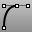

---
---

{: #kanchor1105}{: #kanchor1106}
# HandleCurve
 [Where can I find this command?](javascript:void(0);) Toolbars
 [Curve Drawing](curve-drawing-toolbar.html)  [Curve](curve-toolbar.html) 
Menus
Curve
Free-Form
Handle Curve
The HandleCurve command draws illustration-program-style chained Bézier curves.
Steps
 [Pick](pick-location.html) the first curve point.Pick a handle location.Repeat the steps to place additional points, and press [Enter](enter-key.html) to end the command.Your browser does not support the video tag.Command-line options
Alt key
Press [Alt](alt-key.html) to place a [kink](kink.html).
Ctrl keyclass="Option_Description">Press [Ctrl](ctrl-key.html) to place the point.
AutoClose
Closes the curve when the cursor moves close to the curve's start point.
AutoClose steps
Move the cursor close to the start point of the curve, and pick.The curve will close.Press the [Alt](alt-key.html) key to suspend automatic closing.Close
Closes the curve smoothly, creating a [periodic curve](makeperiodic.html).
Sharp
Closes the curve with a kink, creating a [non-periodic curve](makeperiodic.html#makenonperiodic).
PersistentClose
The PersistentClose option closes the curve as soon as there are two points placed.
If you continue to pick points, the curve updates the shape while remaining closed.
Undo
The Undo option reverses the last action.
See also
 [Draw lines and curves](sak-curve.html) 
&#160;
&#160;
Rhinoceros 6 © 2010-2015 Robert McNeel &amp; Associates.11-Nov-2015
 [Open topic with navigation](handlecurve.html) 

