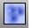
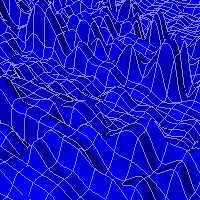

---
---

{: #kanchor1114}{: #kanchor1115}{: #kanchor1116}
# Heightfield
 [Where can I find this command?](javascript:void(0);) Toolbars
 [Surface Creation](surface-creation-toolbar.html)  [Surface Sidebar](surface-sidebar-toolbar.html) 
Menus
Surface
Heightfield from Image
The Heightfield command creates a [NURBS](http://www.rhino3d.com/nurbs) surface or mesh based on grayscale values of the colors in an image file.

Steps
 [Select](select-objects.html) an image file. [Pick](pick-location.html) the first corner.The base of the surface will be parallel to the current construction plane.Pick the second corner or type a length.The shape of the pick rectangle will match the aspect ratio of the image file.Specify options.Heightfield options
Number of sample points ___ x ___
The image's "height" is sampled at the specified number of control points along the u and v [directions](curvesurfacedirection.html) of the image.
Sample count is ___ of 10000 *(surface only)* 
Height ___ &lt; *units* &gt;
Sets the scale of the height of the object.
Set image as texture
Uses the image as a render texture for the created object.
Create vertex colors *(mesh only)* 
Evaluates the color of the texture at each texture coordinate (u,v) and sets the vertex color to match.
See: [ComputeVertexColors](computevertexcolors.html).
Create object by
Mesh with vertexes at sample locations
Creates a mesh with vertex points at each of the sample locations.
Surface with control points at sample locations
Creates a surface with [control points](controlpoint.html) at each of the sample locations.
Interpolate surface through samples
Creates a surface that passes through each sample location's height.
See also
 [Create surfaces](sak-surface.html) 
&#160;
&#160;
Rhinoceros 6 © 2010-2015 Robert McNeel &amp; Associates.11-Nov-2015
 [Open topic with navigation](heightfield.html) 

