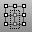
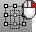

---
---

{: #kanchor1120}{: #kanchor1121}{: #kanchor1122}{: #kanchor1123}{: #kanchor1124}{: #kanchor1125}{: #kanchor1126}{: #kanchor1127}{: #kanchor1128}{: #kanchor1129}{: #kanchor1130}{: #kanchor1131}{: #kanchor1132}{: #kanchor1133}{: #kanchor1134}
# Hide
{: #kanchor1136}
{: #kanchor1135}
{: #top}
 [Where can I find this command?](javascript:void(0);) Toolbars
 [Geometry Fix](geometry-fix-toolbar.html)  [Organic](organic-toolbar.html)  [Popup](popup-toolbar.html)  [Standard](standard-toolbar.html)  [Visibility](visibility-toolbar.html) 
Menus
Edit
Visibility
Hide
Shortcut
 [Ctrl](ctrl-key.html) +H
The Hide command conceals selected objects from view.
Command-line options
To access command-line options
Type ahyphenin front of the command name:-Hide.Name of object set to hide
Give the set of objects a name. The [-Show](#show) command allows showing the named set. For an example, see the [Hide Clusters toolbar](hide-clusters-toolbar.html).

# Related commands

## Show
{: #show}
 [Where can I find this command?](javascript:void(0);) Toolbars
 [Geometry Fix](geometry-fix-toolbar.html)  [Organic](organic-toolbar.html)  [Popup](popup-toolbar.html)  [Standard](standard-toolbar.html) 
 [Visibility](visibility-toolbar.html) 
Menus
Edit
Visibility
Show
Shortcut
 [Ctrl](ctrl-key.html) + [Alt](alt-key.html) +H
The Show command re-displays all hidden objects.
Command-line options
To access command-line options
Type ahyphenin front of the command name:-Show.Name of object set to show
Enter the name of a set of hidden objects. For an example, see the [Hide Clusters toolbar](hide-clusters-toolbar.html).

## ShowSelected
{: #kanchor1137}
{: #showselected}
 [Where can I find this command?](javascript:void(0);) Toolbars
 [Geometry Fix](geometry-fix-toolbar.html)  [Visibility](visibility-toolbar.html) 
Menus
Edit
Visibility
Show Selected
Shortcut
 [Ctrl](ctrl-key.html) + [Shift](shift-key.html) +H
The ShowSelected command re-displays selected hidden objects.
Steps
 [Select](select-objects.html) the objects you want to show, and press [Enter](enter-key.html) .Note
All hidden objects temporarily display and normally visible objects are hidden.This does not affect hidden [control points](controlpoint.html) or [edit points](pointson.html#editpton).
## HideSwap
{: #kanchor1140}
{: #kanchor1139}
{: #kanchor1138}
{: #hideswap}
 [Where can I find this command?](javascript:void(0);) Toolbars
 [Visibility](visibility-toolbar.html) 
Menus
Edit
Visibility
Swap Hidden and Visible
The HideSwap command conceals all visible objects and re-displays all previously hidden objects.

## HidePt
{: #kanchor1142}
{: #kanchor1141}
{: #hidept}
 [Where can I find this command?](javascript:void(0);) Toolbars
 [STL Tools](stl-tools-toolbar.html)  [Visibility](visibility-toolbar.html) 
Menus
Edit
Control Points
Hide Points
The HidePt command conceals selected [control points](controlpoint.html) and [edit points](editpoint.html).

## ShowPt
{: #showpt}
 [Where can I find this command?](javascript:void(0);) Toolbars
 [STL Tools](stl-tools-toolbar.html)  [Visibility](visibility-toolbar.html) 
 [Select Points](select-points-toolbar.html) 
Menus
Edit
Control Points
Show Points
The ShowPt command re-displays all hidden [control points](controlpoint.html) and [edit points](editpoint.html).

## Isolate
{: #kanchor1144}
{: #kanchor1143}
{: #isolate}
 [Where can I find this command?](javascript:void(0);) Toolbars
 [Not on toolbars.](toolbarwhattodo.html) 
Menus
 [Not on menus.](menuwhattodo.html) 
The Isolate command hides all objects except the currently selected object.

## Unisolate
{: #kanchor1145}
{: #unisolate}
 [Where can I find this command?](javascript:void(0);) Toolbars
 [Not on toolbars.](toolbarwhattodo.html) 
Menus
 [Not on menus.](menuwhattodo.html) 
The Unisolate command shows all objects hidden by the [Isolate](#isolate) command.
See also
 [Manage object visibility](sak-visibility.html) 
&#160;
&#160;
Rhinoceros 6 © 2010-2015 Robert McNeel &amp; Associates.11-Nov-2015
 [Open topic with navigation](hide.html) 

