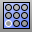

---
---

# Holes toolbar
{: #kanchor2339}
 [To open a toolbar](javascript:void(0);) Toolbars can be opened as a free-standing group or added to the current group.
To open a toolbar as a free-standing group
Click theOptionsicon in any toolbar group.On the menu, clickShow Toolbar, and then select the toolbar name from the list.To open a toolbar as a new tab in the current group
Click theOptionsicon in the toolbar group where you want to add the new tab.On the menu, clickShow or Hide Tabs, and then select the toolbar name from the list. [ArrayHole](arrayhole.html) 
Copy and space holes in rows and columns.
 [ArrayHolePolar](arrayholepolar.html) 
Copy and space holes around a central location.
 [DeleteHole](deletehole.html) 
Delete a hole from a polysurface and remake the surface.
 [MakeHole](makehole.html) 
Project a closed curve to a surface to define a hole.
 [PlaceHole](placehole.html) 
Project a closed curve to a surface to define a hole.
 [MoveHole](movehole.html) 
Move or copy a hole in a planar surface.
 [MoveHole, *Copy* ](movehole.html#copy) 
Copies a hole in a planar surface.
 [RevolvedHole](revolvedhole.html) 
Create holes by revolving a profile curve around an axis.
 [RotateHole](rotatehole.html) 
Rotate a hole around an axis.
 [RoundHole](roundhole.html) 
Create circular holes in surfaces.
&#160;
&#160;
Rhinoceros 6 © 2010-2015 Robert McNeel &amp; Associates.11-Nov-2015
 [Open topic with navigation](holes-toolbar.html) 

